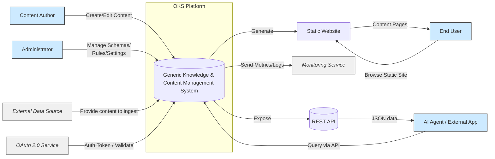
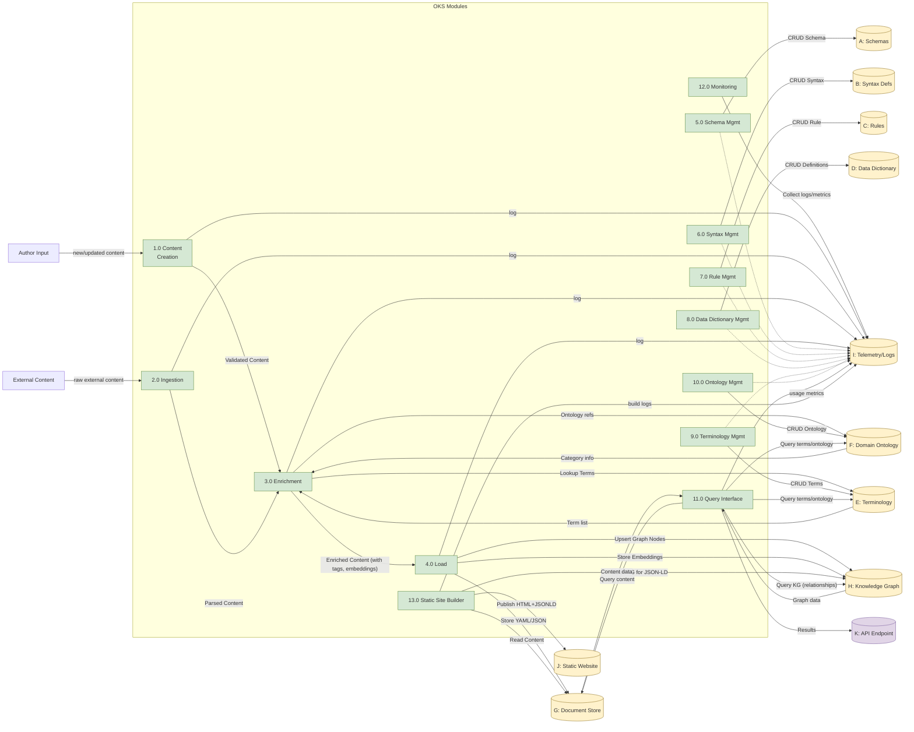
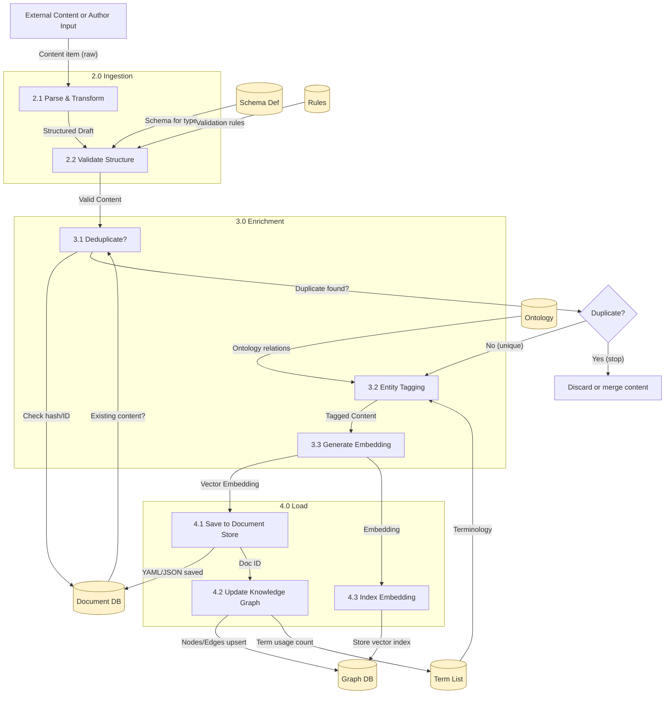
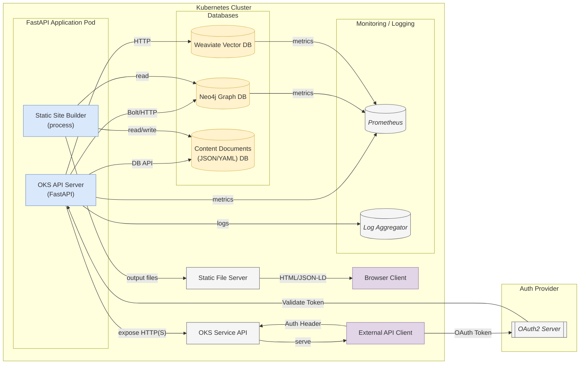
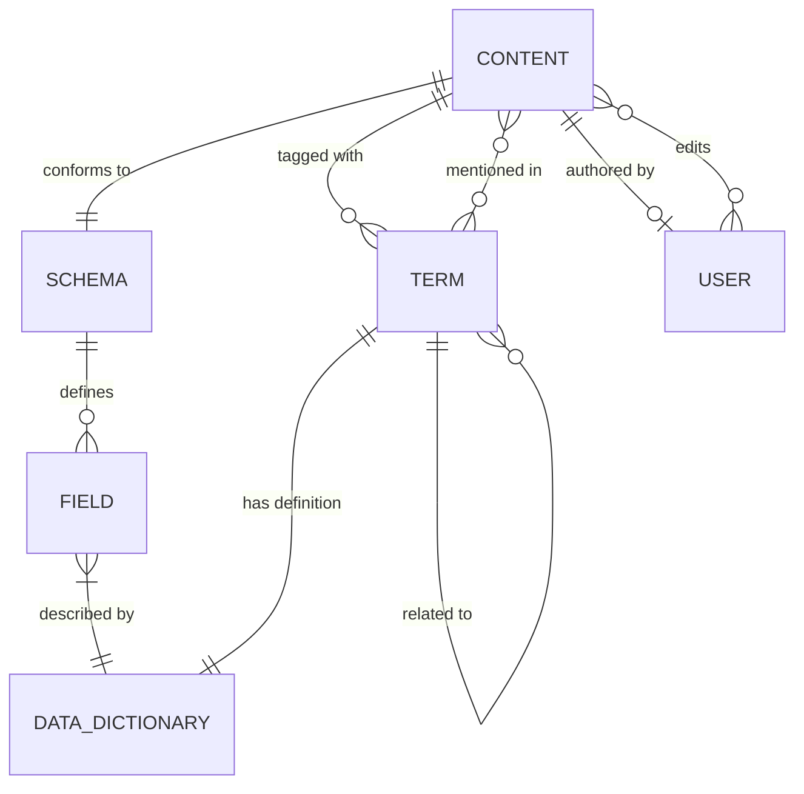

# Overall Description  

### 2.1 Product Perspective  
The OKS is a **new, standalone platform** that combines features of a traditional Content Management System (CMS) with a Knowledge Graph system. It can be seen as a central hub in which content is authored or ingested, enriched with semantic metadata, and then delivered to end users or applications. The system interacts with several external entities: human users (content authors, administrators, and consumers), external data sources (for content ingestion), AI agents or external applications (via API), and external infrastructure services (for authentication and monitoring). The figure in Section 2.7.1 shows the context of OKS relative to these external actors and systems.

Internally, OKS is modular, comprising multiple subsystems (modules) and associated data stores, labeled for reference as follows:  

- **Content Creation Module (1.0):** Provides user interfaces or endpoints for authors to create and edit content. This module ensures authoring is guided by schema (content type) templates and applies validation rules as content is written. It supports an "author-first' workflow where content is created manually in the system.  
- **Ingestion Module (2.0):** Handles import of content from external sources in a "headless-first' workflow. This might include parsing files or feeds, or receiving content via API for automated ingestion. It prepares external content to fit the system's schema and syntax requirements.  
- **Enrichment Module (3.0):** Processes content (whether authored or ingested) to enhance its value. Enrichment includes: deduplication (detecting and avoiding duplicate entries), entity tagging (identifying and linking key terms in content to the terminology/ontology), and embedding generation (creating vector embeddings for each content item for semantic search). The enrichment module may utilize AI/NLP services for entity recognition and embedding.  
- **Load Module (4.0):** Finalizes the content pipeline by storing the enriched content into the various persistence layers. This includes saving the content in the **Document Store (G)** in structured form (e.g. YAML or JSON files/DB documents), updating the **Knowledge Graph (H)** with new or updated nodes/relationships representing the content and its links to terms or other content, and indexing the content's embedding into a vector search index. Essentially, this is the "persist' step of an ETL (Extract-Transform-Load) pipeline.  
- **Schema Management Interface (5.0):** Allows administrators to Create, Read, Update, Delete (CRUD) content type schemas. Through this interface, new content structures can be defined or existing ones modified. The schemas are stored in the **Schema Store (A)** repository.  
- **Syntax Management Interface (6.0):** Allows management of syntax definitions or templates. It might include managing allowed markup or content templates (for example, managing a library of Markdown snippets or YAML templates that authors can use). These are stored in the **Syntax Store (B)**.  
- **Rule Management Interface (7.0):** Enables defining and managing validation rules or business rules that content must adhere to (beyond what the schema defines). Rules are stored in the **Rule Store (C)**.  
- **Data Dictionary Management (8.0):** Interface for curating the data dictionary - i.e. definitions for data fields or terms. The Data Dictionary is stored in repository **D**. This helps standardize field definitions across schemas and provides human-readable descriptions for each data element in the system.  
- **Terminology Management (9.0):** Interface to manage the terminology list - essentially the glossary of domain terms (in **Terminology Store (E)**). Admins can add or modify terms that are recognized in content (for tagging) or used in the ontology.  
- **Ontology Management (10.0):** Interface to manage the domain ontology (in **Ontology Store (F)**). This includes creating categories, sub-categories, and linking terms into the ontology hierarchy. It may integrate with external ontology design tools (like Protégé) for import/export, but internally stores the ontology structure as part of the knowledge graph.  
- **Query Interface (11.0):** Provides search and query capabilities for end-users or AI agents to retrieve content and knowledge. This could be a user-facing search UI on the website or an interactive query console for admins, and also encompasses query endpoints on the API. It leverages the Document Store, Knowledge Graph, and vector index to answer queries.  
- **Monitoring Module (12.0):** Handles system observability. It collects telemetry data (logs, metrics, traces) into **Telemetry/Logs store (I)** and may provide dashboards or alerts. It integrates with external monitoring tools (e.g. Prometheus for metrics scraping, and perhaps Grafana for dashboards) and ensures the system's health and performance can be observed.  
- **Static Site Builder (13.0):** Generates a static website (content pages in HTML, plus JSON-LD metadata) from the content in the system. The outputs are stored/deployed to the **Website repository (J)**. This could integrate with static site generators or custom templates to produce a site that end users can browse without needing the content editing interface. 

The data stores (A through K) mentioned above are logical components where different types of data persist:  

- **A. Schema Store:** Repository of content type schemas (definitions of structure for each content type). Could be in YAML/JSON format and possibly stored in a version-controlled manner.  
- **B. Syntax Store:** Repository of syntax or template definitions. May contain structured representations of content formatting rules or content templates.  
- **C. Rule Store:** Repository of content validation rules or business rules. These could be expressed in a rules engine or as configuration that the content validation engine uses.  
- **D. Data Dictionary:** Database or file store containing definitions of data fields and possibly business glossary terms (with descriptions, data types, allowed values).  
- **E. Terminology Store:** Database of domain-specific terms (keywords, tags, glossary terms). Could include synonyms or mappings. This is closely related to the ontology.  
- **F. Ontology Store:** Storage of the domain ontology graph (categories, subcategories, terms and their relationships). Likely this data is also mirrored in the knowledge graph database (H), but a portion might be managed separately or imported.  
- **G. Document Store:** The main content repository, storing the actual content containers. For example, this might be a NoSQL database or a set of files where each content item is stored as a YAML or JSON document (including the content's structured fields and possibly unstructured body text in Markdown/HTML).  
- **H. Knowledge Graph Store:** The graph database that holds the interconnected representation of knowledge. It contains nodes for content items, nodes for terms/categories (ontology), and edges representing relationships (e.g. "Content A mentions Term X' or "Term X is a subcategory of Term Y'). A graph database like Neo4j is envisioned here for its capabilities in handling complex relationships and queries.  
- **I. Telemetry/Logs Store:** Where system logs, audit trails, and metrics are collected. This could be a combination of log files, a time-series database for metrics, and tracing data. It supports monitoring and debugging.  
- **J. Website (Static Site) Store:** The output location for the static site files. In a deployment, this could be a directory served by a web server or a bucket for a static site host. It's considered a "data store' in that the static HTML/JS/CSS content is stored and served to end users.  
- **K. API:** Technically the API is an interface, but here "API store' can be interpreted as the API endpoint layer of the system. It's where the running API service (FastAPI) exposes content to external clients. (There is no data "stored' in the API, so K is more of a system interface than a data store, but it is listed for completeness of components).  

**Product Relationship to External Systems:** OKS does not replace existing CMS or knowledge bases but is a unique platform. It could, however, integrate with them. For instance, external content sources (like another CMS export or a data feed) can feed into OKS via the ingestion module. The static site output could be integrated into an organization's web presence (for example, publishing the static site to a company docs website). The knowledge graph could integrate with external AI systems via the API (e.g. allowing an LLM-based agent to query for facts or content in OKS). The system relies on an external identity provider (for OAuth 2.0) in production to handle authentication. It also leverages external monitoring (like Prometheus/Grafana or cloud monitoring services) to handle telemetry.  

Below is the system context diagram illustrating OKS and its interactions with users and external systems:

#### 2.7.1 System Context Diagram  

*Figure: System Context Diagram.* The OKS platform interacts with multiple actors: **Content Authors** create content through OKS's interface; **Administrators** configure schemas, rules, and other settings; **External Sources** supply content via ingestion pipelines; **AI Agents or client applications** consume content through the REST API (secured via an OAuth2 **AuthProvider** in production); **End Users** access published content via the generated **Static Website**; and a monitoring system collects **telemetry** from OKS.  

### 2.2 Product Functions  
At a high level, OKS provides the following key functions to fulfill the needs of its users and stakeholders:

- **Content Authoring and Editing:** Authors can create new content items or edit existing ones using a user-friendly interface. The interface enforces structure by letting the author select a content type (schema) and then providing a form or editor corresponding to that schema. The system validates the content in real-time or on submission against the schema and any defined rules, ensuring that the content is structurally sound before it's saved (REQ-002, REQ-003). The authoring interface may support writing content in **YAML** front-matter plus **Markdown** body (a common pattern), or directly in a structured editor. Given that *content is stored in two formats: YAML for data, and Markdown for narrative text* [oai_citation:7‡quire.getty.edu](https://quire.getty.edu/docs-v1/fundamentals/#:~:text=Content%20is%20stored%20in%20two,top%20of%20every%20Markdown%20file), the system will likely separate fields (YAML) from rich text (Markdown) content internally. A critical function here is **schema-validated authoring** - preventing authors from deviating from the defined content model.  

- **Schema and Configuration Management:** Administrators can define and modify the content model of the system through managing schemas, syntax rules, validation rules, and related configuration. This includes creating new content types (with fields, data types, and constraints), defining any content syntax or templates, and authoring validation rules (for example, a rule that no two content items can have the same title if uniqueness is required). These functions (modules 5.0, 6.0, 7.0, 8.0, 9.0, 10.0) ensure the platform is **extensible and customizable** to different domains. For instance, an admin might use the ontology management function to import or build a domain taxonomy (categories and terms), which will then be used for tagging content.  

- **Content Ingestion Pipeline:** The system can ingest content from external sources in an automated way (useful for bulk import or integrating with other systems). An admin or automated job can feed data (e.g. a batch of Markdown files with YAML front-matter, or JSON exports from another system) into the ingestion module. The ingestion function parses the input, maps it to the appropriate schema, and initiates the enrichment process. During ingestion, basic validation is applied to ensure the incoming data matches or can be transformed into the system's schemas. This function enables a **headless-first** workflow, where content could be created outside and then loaded in.  

- **Content Enrichment:** Once content is authored or ingested, the enrichment functions kick in. **Deduplication** checks if a similar content item already exists (by comparing key fields or using content hashes / embeddings to detect duplicates). **Entity tagging** automatically scans the content for known terms (from the terminology store) or named entities, and links them - for example, if "COVID-19' is a term in the terminology store, the enrichment might tag any mention of "COVID-19' in content and link it to that term's entry. This creates a rich linkage between content and the knowledge model. **Embedding generation** uses an AI model to generate a vector representation of the content's textual information; this vector is stored (likely in a vector database or as part of the knowledge graph index) to enable semantic searches (so that a search query can find relevant content even if it doesn't exactly match keywords). These enrichment steps greatly enhance content retrieval and analysis capabilities.  

- **Storage of Content and Knowledge:** The platform provides persistent storage for all aspects of content and knowledge. Content is stored in at least two forms: (1) as structured **YAML/JSON** documents (for precise retrieval and static site generation) and (2) as vector embeddings in a **vector index** for semantic similarity search. Additionally, content and its relationships are stored in a **graph database** (knowledge graph) to allow complex queries over relationships (e.g. find all content items that relate to a certain category or that were authored by the same person, etc.). This dual storage approach (document + graph + vector) ensures flexibility in retrieval: traditional exact queries, relational/graph queries, and AI-driven similarity queries are all supported. The concept of dual storage is aligned with modern knowledge systems where semantic search is combined with structured data management [oai_citation:8‡azumo.com](https://azumo.com/software-developer/weaviate#:~:text=Weaviate%20is%20an%20open,search%20and%20knowledge%20graph%20exploration) [oai_citation:9‡yext.com](https://www.yext.com/platform/content#:~:text=).  

- **Static Site Generation:** A core output of OKS is the ability to publish content as a static website. This function will take the content (from the document store and knowledge graph) and generate human-readable web pages (HTML). Each page corresponds to a content item or a content listing, and includes **JSON-LD metadata** embedding knowledge graph data (for example, marking up authors, dates, topics using schema.org vocabulary). By doing so, the static site is not only a human-facing product (e.g. documentation site or knowledge base) but also machine-friendly. Search engines and AI systems crawling the site can extract structured data from the JSON-LD, making the content more discoverable and useful [oai_citation:10‡yext.com](https://www.yext.com/platform/content#:~:text=). The static site builder might use frameworks like Jekyll, Hugo, or a custom generator integrated with OKS. It needs to handle Markdown to HTML conversion for any rich text fields. During this process, the system must ensure that the structured content is accurately represented and that any special formatting is preserved or transformed appropriately (which raises the consideration of **Markdown vs YAML validation** issues, see Section 2.5).  

- **Search and Query (Knowledge Retrieval):** The platform provides search functionality for end users (through the static site's search feature) and for API consumers. This includes full-text search on content, filtered search (e.g. by category or schema), and semantic search using embeddings. Because content is enriched with tags and connected to ontology terms, users can navigate or query by topics. The query interface might also allow querying the knowledge graph directly (for advanced use cases, possibly via a GraphQL or Cypher query endpoint for power users). For example, a user might query: "find all content items tagged with Term X and created after 2024' - the system would consult the graph and document store to answer that.  

- **API Access (Headless CMS capabilities):** All core content and knowledge management features are accessible via a RESTful API. This API allows external systems or scripts to perform CRUD operations on content (subject to authentication and authorization), query content or the knowledge graph, and possibly manage configuration (for admin-type API calls). This effectively makes OKS a **headless CMS**; an organization could use the API to pull content into a mobile app or integrate with other services. OAuth 2.0 is used to secure these API endpoints (so only authorized applications can access certain data). For instance, an AI chatbot could use an API token to query OKS for information in response to user questions.  

- **Monitoring and Analytics:** The platform includes monitoring of its own operations. This entails logging every significant action (with trace IDs to correlate events - e.g., an ingestion job's steps, user edit actions for audit trail, etc.), collecting performance metrics (like request rates, response times, memory/cpu usage), and exposing these metrics in standard formats (such as Prometheus). The system assures **99% traceability**, meaning virtually all transactions can be traced end-to-end via logs or distributed traces - if a content publish fails, the logs/traces will show where and why. This is critical for debugging the pipelines (ingestion/enrichment) and ensuring content integrity. Additionally, the system tracks usage metrics (like number of reads, popular search terms, etc.) as part of telemetry. These insights can help content managers understand engagement and can also feed into KPIs.  

Security features (though largely non-functional) also manifest as product functions: enforcement of **RBAC** on the interfaces (so only admins can manage schemas, only authenticated users/agents with appropriate roles can post content via API, etc.), and maintenance of **audit logs** for content changes (who changed what and when). The product also includes periodic backups or export functions (not explicitly listed in modules but implied under reliability/maintainability) - content and configurations can be exported (for example, all content as YAML, or the knowledge graph as a JSON-LD graph dump) to avoid vendor lock-in.  

To summarize, OKS functions as an integrated **knowledge-centric content hub**: it not only manages content like a CMS but also enriches it into a knowledge graph. It ensures content quality through schema and rules, enhances findability via semantic enrichment, and delivers content in multiple ways (static site for humans, API for machines). The next sections will detail the requirements that realize these functions.  

### 2.3 User Classes and Characteristics  
Different categories of users (or system actors) will interact with OKS, each with specific needs and technical backgrounds:

- **Content Authors (Users):** These are subject-matter experts or content writers who use the platform to create and update content. They are usually non-technical or semi-technical users. They need a **user-friendly authoring interface** that might resemble a rich text editor or form. They are concerned with easily inputting content, adding media if needed, tagging content with the right terms, and seeing previews of how the content will look on the site. They rely on the system to validate their input (so they don't have to worry about YAML syntax intricacies or schema details). Authors might be aware of basic Markdown for formatting text but should not be required to troubleshoot structural errors - the system should guide them. They do not directly interact with YAML files or the database; everything is through the UI or maybe a desktop editor if the system supports content import. Their technical skill: moderate; main goal: produce high-quality content efficiently.  

- **Administrators (Admins):** These users manage the configuration of the platform. They define schemas (content types), decide what fields content should have, set up validation rules (like "all BlogPost must have at least one Category'), manage the dictionary of terms and ontology to reflect the domain knowledge. They often have a more technical background and understanding of data modeling. Admins might also be responsible for managing user accounts/roles if needed. They require interfaces that might be more complex (e.g. a schema builder UI, forms to input ontology relationships, etc.). They need to ensure consistency and will use the platform's management interfaces extensively. They also care about the platform's health, so they might use monitoring dashboards to see system status. Technical skill: high; main goal: configure the system to represent the knowledge domain and enforce content standards.  

- **End Users (Consumers/Readers):** These are the people who ultimately consume the content, typically via the static website (or possibly via the API if they are developers integrating the content). They do not log into OKS directly. Instead, they experience the content that OKS publishes. Their concern is that the content is easily discoverable (search works well), the site is fast and available, and the information is accurate and up-to-date. They benefit indirectly from OKS features like JSON-LD (which can improve search engine results for the site, helping end users find the content). If the static site includes interactive search (like a search box for the knowledge base), they use that, which calls OKS's query interface behind the scenes. End users may range from general public readers to internal employees, depending on the deployment of the site. Technical skill: low; main goal: find and read content.  

- **External Application Developers / AI Agents:** This class includes any system or developer that uses the OKS API. For example, an AI agent (like a question-answering bot) might query the OKS to retrieve relevant content to feed into an answer. Or a mobile app might pull content from OKS to display to users within the app. These users interact through machine interfaces (REST API, possibly GraphQL or other if implemented). They need comprehensive API documentation, stable endpoints, and secure access (OAuth tokens). They also care about performance (the API should respond quickly) and reliability. Technical skill: high (developers); main goal: programmatically utilize the content/knowledge managed by OKS, possibly in real-time scenarios (e.g. an AI agent retrieving answers).  

- **System Operators/DevOps Engineers:** These are not end-users of the content but are responsible for deploying and maintaining the OKS application (particularly relevant if the system is self-hosted by an organization). They will use Docker/Kubernetes to deploy the system, monitor resource usage, and ensure uptime to meet SLAs. They interface with the system through logs, monitoring endpoints (Prometheus metrics), and admin tools. They need the system to be container-friendly and to expose health checks. Technical skill: very high; goal: keep the system running smoothly, scalable, and secure.  

Each user class has distinct usage scenarios, which the requirements must accommodate. For instance, authors should not be bothered with raw YAML editing unless they choose to; the system might have behind-the-scenes YAML but surface a nicer interface. However, for the PoC, authors might actually edit YAML files directly or through a simple text area - but this would be refined in production tools. Similarly, admins might need to import an ontology from Protégé - the system should allow importing an OWL or TTL file to populate the ontology store, or provide UI to manually input it. External developers might request new API endpoints if needed (for example, maybe initially only GET (read) APIs are available, but later there might be need for POST (write) via API which then must obey rules, etc.). 

The user classes and their characteristics guide many of the usability and accessibility requirements (e.g., UI must be intuitive for authors, API must be well-documented for developers, etc.) which will be detailed in the requirements section. 

### 2.4 Operating Environment  
The OKS is envisioned as an application that can run on modern servers or cloud environments, containerized for ease of deployment. The primary technologies and environment considerations are:  

- **Open-Source Stack:** The application will be built with open-source technologies, primarily using **Python** for the backend logic (FastAPI framework for the web API and possibly web UI). This choice ensures extensibility and a broad community support. The knowledge graph database will likely be **Neo4j** (a popular graph DB suitable for ontology and content networks), and the vector search capability will be provided by a vector database like **Weaviate**. Weaviate is an open-source vector search engine that also has knowledge graph features [oai_citation:11‡azumo.com](https://azumo.com/software-developer/weaviate#:~:text=Hire%20Nearshore%20Weaviate%20Developers%20,search%20and%20knowledge%20graph%20exploration), making it well-suited to integrate semantic search with structured data. In our architecture, Neo4j will handle the rich graph queries and relationships, while Weaviate (or an equivalent) will handle high-performance vector similarity queries. The Document store could be something like a lightweight NoSQL database (e.g. MongoDB or even just Git-managed YAML files for PoC). All these components are open-source, aligning with an extensibility ethos.  

- **Hardware and OS:** The platform is server-based. In a PoC or small deployment, all components could run on a single machine (e.g. a Linux server running Docker containers for the API, Neo4j, Weaviate, etc.). In production, it might be distributed: e.g., Kubernetes cluster running multiple instances of the API (to handle ~400 concurrent users as required), a Neo4j cluster for resilience, etc. The system should be OS-agnostic to an extent (Docker ensures this). It will likely run on Linux (the most common environment for these tools). The static site can be served via any web server or CDN (Nginx, Apache, or cloud object storage).  

- **External Services:** The OAuth 2.0 provider is external - perhaps Auth0, Keycloak, or the organization's SSO. The OKS will integrate with it by verifying tokens on API requests but will not run the identity service itself. Monitoring expects an external Prometheus to scrape metrics and possibly an ELK stack or similar for logs. Thus, OKS provides endpoints (like `/metrics`) and log output, but the actual storage and visualization might be handled externally.  

- **Development and Testing Environment:** The system will be developed using Python, so it will need a Python runtime (likely 3.10+ for FastAPI). Unit and integration testing might use Docker Compose to spin up the environment (API + Neo4j + Weaviate, etc.). The PoC environment is "local', meaning minimal nodes (maybe even without full auth, and minimal data). Production environment will consider load (the requirement of 10k writes/min suggests an environment with possibly multiple API instances and a robust DB setup).  

- **Deployment Environment:** The system is intended to be portable via Docker containers. For example, one container for the FastAPI application, one for Neo4j, one for Weaviate, etc. A Kubernetes deployment YAML or Helm chart would orchestrate these in production. The static site builder might run as a job or sidecar container that writes to a volume or cloud storage bucket. The environment must support container orchestration; a production scenario might run on a cloud Kubernetes service or on-premises cluster. The requirement of Kubernetes support (portability) means no component should be tied to a specific host environment - e.g., use environment variables for config, avoid assumptions about local file paths (use volumes), etc.  

- **Network:** OKS (API) will listen on HTTP/HTTPS (in production, behind a TLS termination proxy for HTTPS). It will communicate with Neo4j (bolt or HTTP protocol) and Weaviate (HTTP) over an internal network. In cloud or cluster, these should be in a secure network or namespace. The static site might be delivered over a CDN or simple static server. The monitoring communications (Prometheus scraping / pushing metrics, log shipping) should be considered as well.  

- **Compliance Environment:** If used in certain domains, OKS might operate under compliance requirements (not explicitly stated, but security suggests it should meet at least OWASP ASVS L2). That means the operating environment should be hardened (regular OS updates, container images without vulnerabilities, etc.). Also, since content could be sensitive, if deployed internally, the environment might be within a corporate firewall or VPC.  

- **Browser Compatibility:** The static site (which is the main user-facing component for end-users) must be compatible with modern web browsers. The authoring/admin UI (if web-based) should also support modern browsers and possibly have a responsive design (not a strict requirement here, but typically needed).  

In summary, the operating environment is a **containerized microservice environment** comprising the OKS app and supporting databases, capable of running on local or cloud infrastructure. It will be configured and scaled according to the specified performance needs (see Non-Functional Requirements for specifics like "≥10k writes/min').  

### 2.5 Design and Implementation Constraints  
The design of OKS is influenced by several constraints and choices:

- **Standards and Protocols:** The system will adhere to **RESTful API standards** for its external API, using JSON payloads. It will also adhere to **OAuth 2.0** standards for auth (likely the "Bearer token' scheme for API requests). For content metadata, using **JSON-LD** means following W3C's JSON-LD 1.1 spec, and likely schema.org vocabulary for content where appropriate (to maximize SEO and AI understanding).  

- **Technology Constraints:** We have committed to an open-source toolchain. Specifically, **FastAPI** (a Python web framework) for implementing the API and possibly server-side rendering if needed. The database choices (Neo4j and Weaviate) mean we design the data models to fit those: e.g., Neo4j stores nodes/relationships so content and terms need unique identifiers and a clear schema within the graph (maybe labels like :Content, :Term, etc.). Weaviate's use imposes that content and terms might also exist as "objects' in Weaviate with vector properties - we might need to keep Neo4j and Weaviate in sync or use Weaviate's hybrid search capabilities if we integrate the knowledge graph into it.  
  Another constraint: **Docker** and **Kubernetes** as target deployment means writing 12-factor style apps (externalizing configuration to env vars, etc.), handling statelessness in the API (so it can scale horizontally), and using persistent volumes for databases.  

- **Data Constraints:** The system must handle **both YAML and Markdown** content. One known issue is validation when authors use Markdown inside YAML (for example, if an author wants to include richly formatted text in a YAML field using the `|` multiline syntax). YAML is whitespace sensitive and certain characters (colons, quotes) can break it easily [oai_citation:12‡chrisdaaz.github.io](https://chrisdaaz.github.io/static-web-scholcomm/tutorials/static-site-generators/#:~:text=YAML%20syntax%20is%20strict%3B%20invalid,an%20error%20you%20don%E2%80%99t%20understand). This has been a source of errors in many static site setups (where a stray colon in YAML without quotes causes a build fail). We must design robust validation or editing experiences to mitigate this. One approach is to restrict authors from needing to write raw YAML - instead provide form fields that generate YAML behind the scenes. If authors do write Markdown, it should typically be in the body of content (separate from YAML front-matter). The system should validate the YAML front-matter or structured fields using a schema (possibly a JSON Schema validation) to catch errors early [oai_citation:13‡ndumas.com](https://ndumas.com/2023/06/validating-yaml-frontmatter-with-jsonschema/#:~:text=I%20had%20is%20that%20most,content%20of%20a%20YAML%20document). We know *YAML syntax is strict and invalid YAML can break the site* [oai_citation:14‡chrisdaaz.github.io](https://chrisdaaz.github.io/static-web-scholcomm/tutorials/static-site-generators/#:~:text=YAML%20syntax%20is%20strict%3B%20invalid,an%20error%20you%20don%E2%80%99t%20understand), so during content save or ingestion, the system should run a YAML parse/validate (and report meaningful errors). Also, if authors use Markdown in content body, we should sanitize or ensure it doesn't accidentally contain YAML-like sequences that confuse the parser. This interplay of Markdown/YAML is a constraint we acknowledge; the design might opt to store content in pure YAML (all fields, including a field that holds Markdown text). In such case, need to properly quote or use `|` for multi-line text, and maybe automatically escape problematic characters in that text when serializing to YAML. Alternatively, the content could be stored in JSON (which has no ambiguities with colons/quotes) internally, and then output to a Markdown+FrontMatter format only when needed for static site. Tools exist to validate YAML front matter with JSON Schema [oai_citation:15‡ndumas.com](https://ndumas.com/2023/06/validating-yaml-frontmatter-with-jsonschema/#:~:text=This%20is%20a%20project%20I%E2%80%99ve,content%20of%20a%20YAML%20document), and we will incorporate such techniques.  

- **Scalability Constraints:** We have a requirement to handle **10,000 container writes per minute**. This is a significant rate - the design must avoid bottlenecks. It implies concurrency (likely multiple ingestion threads or workers). Using Python, one constraint is the GIL (Global Interpreter Lock) which can limit multi-threaded CPU-bound tasks. We might employ multi-processing or an async approach for I/O bound tasks. The architecture likely needs to queue ingestion or use streaming writes to DB. Also, Neo4j and Weaviate must be configured to handle that write throughput - possibly by batching transactions or scaling cluster. For reads, ≤150ms latency constraint means caching might be needed (or just ensure DB queries are optimized, use indexing, etc.). The system design must consider eventual consistency between the document store and KG if necessary to achieve throughput (maybe writes go to one and the other is updated asynchronously). Also, supporting **400 concurrent users** means our API and static site must be tuned (the static site should handle that easily if on CDN; the API needs to be load-balanced with enough workers/instances).  

- **Extensibility & Modularity:** Being open-source and extensible means the design should allow plugging in new components or replacing parts. For example, if someone wants to use a different vector DB or if they want to add a new enrichment step (like content classification), it should be feasible. This constraints us to loosely couple components - e.g., communicate via clear interfaces or use an internal event bus. For the PoC, though, simplicity might prevail (function calls rather than a full message queue). But we should design modules so that one can be modified without heavy impact on others (e.g., adding a new data store for caching doesn't break existing code).  

- **Security Constraints:** OWASP ASVS Level 2 imposes certain design constraints: we must implement **secure authentication** (OAuth 2.0 flows, no plain text passwords, etc.), **strong access control** (authorize every request based on user role and data ownership), **input validation** to prevent XSS/Injection (e.g., sanitizing any HTML in content, parameterizing queries to Neo4j to avoid Cypher injection, etc.), **secure configurations** (no default passwords in DB, proper TLS), and so on [oai_citation:16‡versprite.com](https://versprite.com/blog/software-development-life-cycle/#:~:text=Level%201%20%E2%80%93%20First%20step%2C,verify%20with%20black%20box%20testing). We must also ensure an **audit trail** - meaning design must include logging of security-relevant events (logins, schema changes, content modifications). Audit logs might be stored in Telemetry store and must be tamper-evident (perhaps append-only or with integrity checks). Furthermore, using third-party libraries means we track their updates to patch vulns (the open-source constraint means we rely on community updates; as a design, possibly make it easy to update these components).  

- **Usability Constraints:** The UI (for authors/admins) should be web-based (to be accessible widely). This means front-end constraints: likely use a standard web tech (HTML/JS). Perhaps using a JS framework (React/Vue) for a smooth admin UI is expected. If so, design might be constrained by needing to implement API endpoints that the JS frontend can call (i.e., even the admin UI might be a separate single-page app consuming the same REST API). For PoC, maybe a minimal UI or direct file editing is fine, but for production, a proper UI is needed. We plan for it even if not fully implemented in PoC.  

- **Integration Constraints:** Integration with Protégé (for ontology import) suggests we might constrain the ontology format to OWL/RDF. Possibly the system will need to accept an OWL file and convert it into internal nodes. This could constrain us to certain ontology features or require using libraries for parsing OWL. If this is complex, an alternative is expecting admins to export CSV of terms and relationships, etc., but ideally direct OWL support is there.  

In summary, constraints arise from performance targets (which push a scalable, distributed design), technology choices (which push certain data modeling and interfacing patterns), and content format (necessitating robust YAML/Markdown handling). The design documented in architecture diagrams (Section 2.7) reflects these constraints by showing multiple integrated components and the flow of data among them. 

### 2.6 Assumptions and Dependencies  
Throughout this SRS, we make a few assumptions and note external dependencies:

- **Open-Source Components Availability:** We assume that Neo4j, Weaviate, FastAPI, etc., are available and appropriate for use. The project depends on these communities for updates (e.g., bug fixes in those platforms). If any of these were to become untenable (license change, performance issue), we assume we can find alternatives (e.g. use a different vector DB, or use an alternative graph store like JanusGraph, etc.). For now, the design leans on these specific tools due to their strengths (Neo4j for rich graph queries, Weaviate for combined vector+filter search [oai_citation:17‡azumo.com](https://azumo.com/software-developer/weaviate#:~:text=Hire%20Nearshore%20Weaviate%20Developers%20,search%20and%20knowledge%20graph%20exploration)).  

- **Proof-of-Concept vs Production Differences:** We assume that the initial PoC deployment will be local and possibly without full security. For example, we will **not require authentication in the PoC environment** to simplify testing (all users are trusted or it's a closed environment). However, we assume that when moving to production, an OAuth2 identity provider will be configured and all API calls will require valid tokens. We also assume that enabling this later is straightforward (the code will include hooks for auth, just not enforced in PoC config). Similarly, PoC might run everything on one node with minimal data, whereas production might distribute components. We assume linear scalability (that adding more instances will linearly increase throughput up to a point, which should hold given stateless API and horizontally scalable DB nodes).  

- **User Behavior Assumptions:** We assume authors will generally use the provided UI and not try to circumvent validation (like editing content database directly). This is important because our validation (schema/rule enforcement) is at the application level. If someone bypasses it (like manually editing the DB), they could introduce invalid content. In production, access to the DB is restricted, so this assumption is fine.  

- **Ontology Design Assumption:** The ontology imported via Protégé is assumed to be fairly tree-structured (category/subcategory/term as described). We assume it doesn't include extremely complex OWL constructs that we can't represent in a simple graph (for instance, if there were ontology logical rules or properties, we might not support all of that). We will represent the ontology as simple hierarchy and associative relationships in Neo4j. If the domain needs more, it might be out of scope.  

- **Concurrent Usage Assumptions:** The requirement mentions 400 concurrent users, 10 AI agents, and 1 ingestion job at a time. We assume that 400 concurrent human users are mostly browsing or searching the static site (which offloads query load mostly to the static site or cached API queries), meaning the system (API/DB) is not hammered by 400 heavy writes at once. The 10 AI agents might be performing queries concurrently though - but still read-heavy. The 1 ingestion job at a time suggests we won't have multiple bulk imports running simultaneously (which simplifies ensuring consistency and avoiding race conditions in enrichment). This assumption means we may not need a complex job scheduler to coordinate multiple ingestions - one at a time is acceptable.  

- **Performance Baseline and Scaling:** We assume that the 10k writes/minute is a target peak load for content creation (which could be ingestion). We will design to that, but we assume average load is much lower (maybe normal operations see far fewer writes, and this number is for, say, an initial bulk load or an extreme scenario). We depend on being able to do partial updates (like only update certain indexes after bulk load or disable some expensive checks during bulk ingestion if needed). We assume the underlying DBs can handle this with proper configuration (e.g., Neo4j can do ~hundreds or thousands of writes per second with batch commits; Weaviate can batch vectors etc.). If not, we might rely on scaling out or adjusting consistency (e.g. eventually consistent updates to KG).  

- **KPI/SLA Determination:** We assume that initial KPI targets (like latency, throughput, uptime) will be refined through testing and real usage data. We plan to set baseline metrics by conducting performance tests under expected loads, and then define SLAs accordingly (for instance, if tests show we can comfortably do 12k writes/min, we set SLA at 10k to have headroom). We depend on the availability of performance testing tools and realistic data volumes to simulate this. The Radview reference suggests using performance test results as foundations for SLAs [oai_citation:18‡radview.com](https://www.radview.com/blog/in-the-spotlight-the-sla-for-performance-and-load-testing/#:~:text=application%20will%20perform%20under%20excessive,foundation%20data%20for%20performance%20SLAs); we assume we will follow that approach - meaning the SLA numbers in this document (10k/min, 150ms, 99% trace, etc.) are initial goals and will be validated and possibly adjusted once we have empirical data in staging.  

- **Static Site Content Delivery:** We assume that the static site, once generated, will be delivered via a reliable mechanism (like an AWS S3 + CloudFront or GitHub Pages, etc.). That environment is expected to provide high uptime and low latency globally, which complements our system's availability (since even if the OKS API is down for maintenance, the static site can still serve content). We assume the static site only updates when content is changed or on a schedule (not continuously every second), so generating it is not a constant heavy load, but a periodic task. 

- **Backup and Recovery:** We assume that standard backup procedures will be followed (e.g., regular dumps of Neo4j and the document store, vector index regeneration if needed). The system design might include an export function (not in requirements explicitly, but good practice).  

In terms of dependencies: OKS depends on the correct functioning of external services like the identity provider (for secure mode) and the monitoring stack for alerting. If those are misconfigured or unavailable, OKS can still function in core content management, but security/observability might be compromised. We assume those external pieces are in place in production.  

Finally, we assume stakeholder support for the open-source approach - i.e., that using and contributing to open-source is acceptable and no requirement to use proprietary CMS or DBs emerges. The community-driven development can be an asset for extensibility and longevity of the project.  

With these assumptions clarified, we proceed to illustrate the system architecture and then the detailed requirements. Any changes in assumptions (like a need to support multiple simultaneous ingestion jobs, or much higher concurrency) would necessitate revisiting some requirements and design decisions.  

### 2.7 System Architecture and Workflow  
This section provides an overview of how the OKS components work together, via a series of diagrams.

#### 2.7.2 Data Flow Diagram - Level 1  
The following data flow diagram (DFD) shows the major processes (modules 1.0-13.0) of OKS and how data flows between processes and data stores (A-K). It represents a high-level (Level 1) view of the system's internal operations:

*Figure: DFD Level 1.* This diagram depicts how content flows through OKS: Content can enter via **Content Creation (P1)** or **Ingestion (P2)**. Both feed into the **Enrichment process (P3)**, which uses the Terminology (E) and Ontology (F) data to tag content and produce embeddings. The enriched content is then passed to **Load (P4)**, which writes data into the Document Store (G) and updates the Knowledge Graph (H). Meanwhile, administrators manage schemas, syntax rules, validation rules, data dictionary, terminology, and ontology via processes P5-P10 which directly update their respective stores (A-F). The **Static Site Builder (P13)** pulls content from the Document Store (G) and contextual info from the Knowledge Graph (H) to produce the static site (J). The **Query Interface (P11)** services user queries or API calls by retrieving data from the Document Store and Knowledge Graph (and references from E/F if needed), then returns results via the API endpoint (K) to the requester. **Monitoring (P12)** aggregates logs and metrics from various processes into the Telemetry store (I).  

This high-level flow ensures all modules interact in a controlled manner: for example, authors indirectly cause updates to G and H via the pipeline 1.0→3.0→4.0, and any schema changes in A would influence how P1/P2 validate content, etc.  

#### 2.7.3 Data Flow Diagram - Level 2 (Content Pipeline)  
The next diagram zooms into the content processing pipeline, detailing sub-processes within Ingestion, Enrichment, and Load (processes 2.0, 3.0, 4.0 from above). This is a DFD Level 2 focusing on how a single content item goes from raw input to fully stored and indexed:

*Figure: DFD Level 2 for Content Pipeline.* When content comes in (from an author or external source), **2.1 Parse & Transform** (P2.1) will convert it into the internal representation (e.g., parse front-matter, map fields to schema structure). Then **2.2 Validate Structure** checks it against the Schema (A) and any Rules (C). If the content fails validation (missing required fields, field types mismatch, or rule violation), it would be rejected or sent back for correction (not explicitly shown, but it would loop back to the author or log an error for ingestion). Once valid, the content goes to **3.1 Deduplicate** which queries the Document Store (G) to see if an item with the same title or checksum exists. If a duplicate is found, the process might stop or mark the content as needing review (in practice, perhaps it updates the existing content or discards the new one as shown). Assuming it's unique, **3.2 Entity Tagging** takes the content text and scans for occurrences of known terms (E) or matches to ontology patterns (F) - for instance, if ontology knows "Python' is under category "Programming Language,' the text "Python' gets tagged with that term. The output is content annotated with tags or links (like adding a list of term IDs that were found). Then **3.3 Generate Embedding** runs an AI model to produce a vector representation of the content (the text). That embedding plus the tagged content are passed to the Load phase. **4.1 Save to Document Store** writes the structured content (with tags, etc.) to the Document DB (G). It might also assign a unique ID if not already assigned. **4.2 Update Knowledge Graph** then creates/updates nodes: a content node in Graph DB (H) with relationships to term nodes (if content has tags, create relationships "CONTENT -> TERM') and other metadata relationships (like "CONTENT -> SCHEMA' if we model that, or author info). The ontology (F/E) might also get updated counts or new entries if a new term was discovered (though likely new terms wouldn't be auto-added without admin approval, so mostly it would increment tag usage counts or create link edges). **4.3 Index Embedding** stores the embedding vector in the vector index (which for simplicity we depict as part of H's functionality). In practice, H might represent two physical stores: Neo4j for graph and Weaviate for vectors, but conceptually it's knowledge index. After this pipeline, the content is fully stored and ready for querying and site generation.  

This pipeline ensures that by the time content is saved: it is valid, unique, enriched with knowledge, and efficiently searchable (via text or semantic similarity). We also highlight that any point can log telemetry (not drawn to avoid clutter, but each step could log success/failure to I). The decision diamond for duplicates shows a possible branch where duplicate content is handled gracefully (the requirement might be to not allow exact duplicates, or to merge them).  

#### 2.7.4 Deployment Diagram  
The deployment diagram below outlines a possible production deployment of OKS components on a Kubernetes cluster. It shows how the software pieces map to deployment units (containers, pods, etc.) and their communication.  

*Figure: Deployment Diagram.* The OKS API Server runs in one or more containers (within an "App Pod'), likely alongside a Static Site Builder process or job container. The API server interacts with the **Neo4j** and **Weaviate** databases and a **Document Store** (which could be a database or even a shared file system). In Kubernetes, these could be separate pods for each database, possibly managed by their own operators (Neo4j cluster, etc.). There is a Kubernetes Service that exposes the API to external clients (with HTTPS termination). External API clients must first obtain an OAuth token from an Auth Server and include it in requests; the OKS API server validates these tokens (either by introspection or signature, via the Auth Server). The Static Site Builder writes out files to a location that a web server (or static storage bucket) serves - this is shown as writing to DocStore (if DocStore is file-based, e.g. a shared volume) and a separate **WebServer** serving it to end users. Alternatively, StaticBuilder might directly deploy to a CDN. Monitoring components like Prometheus scrape metrics from API and DBs, and a log aggregator collects logs for analysis. The diagram shows logical communications: for instance, Prometheus might run outside the cluster or as a pod, scraping `/metrics` endpoints on the API and DB pods. The log agent could be Fluentd or similar shipping logs to ELK. The main point is that the application and DBs are containerized and interact over the network, and the system is designed to be horizontally scalable (we can run multiple AppPod replicas behind the service to handle more load). Docker containerization ensures **portability** - the whole stack can be run in different environments with consistent behavior.  

For the PoC deployment (not explicitly shown), all these might run on one VM or docker-compose, possibly without the AuthSystem and with minimal monitoring. But this deployment diagram represents the target production setup aligning to requirements: it shows separation of concerns (API vs DB vs static serving), use of Docker/K8s (for portability), and integration with auth and monitoring (for security and observability).  

#### 2.7.5 Core Data Model (Entity/KG) Diagram  
Lastly, we present an entity relationship model for the core concepts stored in the knowledge graph and content store. This combines the content model and ontology model. 

*Figure: Entity Relationship Model (simplified).* Key entity types: **Content**, **Schema**, **Field**, **Term**, **User**, **DataDictionary**. A **Content** item conforms to exactly one Schema (each content has a content type) [oai_citation:19‡thedatamaven.net](https://thedatamaven.net/2017/04/whats-the-difference-glossary-dictionary-taxonomy-ontology/#:~:text=A%20Data%20Dictionary%20is%20an,will%C2%A0include%20semantic%20name%20and%20definition). Each Schema defines one or many Fields (with Field names and types usually standardized via Data Dictionary). A Field is described by a Data Dictionary entry (for consistency of meaning across schemas, e.g. multiple schemas can have a field "Title' which refers to the same dictionary definition). **Term** entities represent glossary/ontology terms. A Term can have a definition in the Data Dictionary (especially if terms are also treated as glossary entries) - in many cases, business glossary and data dictionary overlap [oai_citation:20‡alation.com](https://www.alation.com/blog/data-dictionary-vs-business-glossary/#:~:text=Data%20Dictionary%20vs,business%20teams%20around%20a), so we depict that a Term may have one definition entry. Terms can have hierarchical relationships to other Terms (the "parent_of' self-relationship), which is how categories and subcategories are represented (a Category is simply a Term that has child Terms). Terms may also have lateral "related_to' relationships (for non-hierarchy associations, e.g. synonyms or see-also links). Content items can be tagged_with multiple Terms (and a Term can tag multiple contents, that is many-to-many). The relationship "mentioned_in' is the inverse: it shows Terms are mentioned in Content - effectively the same link as tagged_with but from the Term's perspective. We also include **User** entity to represent authors or editors; a Content is authored_by one User (for provenance), and users can edit multiple contents. The Data Dictionary likely contains entries for field definitions, but we also allow that it can store definitions for terms so it can serve as a unified glossary repository if needed. 

In the Knowledge Graph (H), we would implement this model: Content nodes, Term nodes, Schema nodes, etc., with edges for these relationships. For example, a Content node (id "article123') would have an edge "conforms_to' to a Schema node "ArticleType', edges "tagged_with' to Term nodes like "Machine Learning' or "Python', and an edge "authored_by' to a User node representing the author. The Term "Machine Learning' might have parent "Artificial Intelligence' (Term hierarchy), and might have a DataDictionary entry giving a description. 

This model ensures that queries can traverse, say, from a Term to all Content items that mention it, or from a Content to its Schema and then to definitions of each field (if needed for auto-generating documentation of content structure). The vector embeddings are not shown here as separate entities - likely the embedding is an attribute of Content or a separate index keyed by content ID. If we considered an "Embedding' entity, it would be one-to-one with Content, so not much need to depict it separately. Instead, the vector is stored in Weaviate keyed by content ID (and Weaviate itself can store some class schema, but that's a technical detail hidden from conceptual ER model). 

This ER diagram guides the implementation of both the graph database schema and how the application code structures objects. For example, in Neo4j we might have labels :Content, :Term, :Schema, etc. The **JSON-LD** representation on the static site will effectively expose parts of this graph (for example, embedding "author': {name:…} and "keywords' (terms) in the page, corresponding to these relationships, using schema.org vocabulary for Person, Article, etc.). In summary, the data model tightly interlinks content with knowledge, fulfilling the project's aim of a knowledge-centric CMS.

Having covered the overall system context, architecture, workflows, and data model, we now proceed to the formal requirements that the system must meet. These requirements are derived from the above understanding and the specific needs stated. Each requirement is labeled (REQ-***) and traceable to the features and components described.  