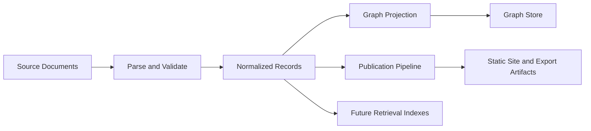

# 2. System Model And Design Principles

Open Knowledge Systems is best understood as a governed content pipeline, not as a single application surface. This chapter establishes the system boundary, the major data forms, the transformation sequence, and the principles that constrain later implementation choices.

Authoring, normalization, validation, storage, graph projection, retrieval, and publication are distinct responsibilities. They may share infrastructure, but they should not be treated as the same problem.

## 2.1 Problem Frame

Most organizations already have content. What they lack is a reliable way to turn that content into a system that is structurally consistent, machine-readable, searchable, and operationally defensible.

Three failures recur:

- content is published before its structure is validated
- metadata is attached inconsistently or too late
- retrieval requirements are imposed on content that was never modeled for retrieval

OKS is a response to those failures. It treats content as a managed asset that moves through explicit technical boundaries. A document is not only text. It is also an input to validation, a source for normalized records, a candidate for graph projection, and a unit of publication.

## 2.2 System Boundary

The target platform described in this manuscript includes a broader set of capabilities than the current repository implements. It is therefore useful to define the boundary at two levels.

### 2.2.1 Target Platform Boundary

The target platform includes:

- schema-governed authoring and ingestion
- structural and business-rule validation
- content normalization
- document-form storage
- graph projection and graph storage
- retrieval interfaces for both humans and machines
- publication pipelines for static outputs
- operational controls such as telemetry, identity, and performance monitoring

### 2.2.2 Current Repository Boundary

The repository currently implements only the normalization core:

- Markdown source documents with optional YAML front matter
- heading-based chunk extraction
- stable normalized records
- graph-oriented projection suitable for downstream loading
- tests that validate the transformation boundary

That narrower implementation is the evidence-bearing center of the current system.

## 2.3 Core System Model

The system model revolves around four content forms.

### 2.3.1 Source Document

The source document is the author-facing unit. In the current implementation it is a Markdown file, optionally preceded by YAML front matter. It is optimized for readability, version control, and low-friction editing.

### 2.3.2 Normalized Record

The normalized record is the first machine-governed form. It is derived from the source document by parsing front matter, separating content from metadata, chunking the body, and assigning stable identifiers. This is the most important boundary in the system because every later capability depends on its correctness.

### 2.3.3 Graph Projection

The graph projection is a relationship-oriented form derived from normalized records. It expresses entities and relationships suitable for graph traversal, relationship-aware retrieval, and ontology alignment. It is not the source of truth for authored content. It is a downstream representation optimized for a different class of queries.

### 2.3.4 Published Artifact

The published artifact is the human-facing or machine-consumable output produced from the governed content model. In this repository that includes the static documentation site and auxiliary publication artifacts such as EPUB and PDF. In a fuller system it could also include JSON-LD-rich pages, APIs, or other delivery surfaces.

## 2.4 Content Lifecycle

The intended lifecycle of content in OKS is:

1. A source document is authored or ingested.
2. The input is parsed and structurally validated.
3. The document is normalized into stable records.
4. Derived forms are generated for graph use, retrieval, or publication.
5. Outputs are published to the relevant delivery surfaces.
6. Validation, telemetry, and tests provide confidence that the pipeline remains trustworthy.

This sequence matters. It forces graph modeling and retrieval to depend on stable content contracts rather than on ad hoc interpretation.

## 2.5 Architectural Responsibilities

The target platform can be described as a set of cooperating responsibilities rather than as a list of product modules.

### 2.5.1 Authoring And Ingestion

This responsibility accepts source material and enforces the authoring contract. In the current repository that contract is intentionally narrow: Markdown plus optional front matter. In a larger platform the same responsibility would include richer schema-governed authoring interfaces and external ingestion channels.

### 2.5.2 Normalization And Validation

This responsibility produces the stable intermediate form that the rest of the system depends on. It includes parsing, structural validation, chunk extraction, identifier assignment, and any deterministic checks required to keep downstream behavior predictable.

### 2.5.3 Storage And Projection

This responsibility maintains the distinction between source-of-truth content and derived representations. The document form preserves authored structure and text. The graph form exposes entities and relationships. A future vector or search index would form a third derived representation optimized for retrieval.

### 2.5.4 Retrieval And Publication

This responsibility exposes governed content to users and systems. It includes static publication, machine-readable output, and query interfaces. Publication is not an afterthought; it is where the consequences of earlier modeling choices become visible.

### 2.5.5 Operations And Control

This responsibility makes the system defensible in production. It includes telemetry, auditability, performance measurement, identity integration, and deployment discipline. These concerns should shape architecture early even if the current implementation only sketches them.

## 2.6 Logical Architecture

The logical system can be viewed as a pipeline with explicit boundaries:

```mermaid
flowchart LR
    A[Source Documents] --> B[Parse and Validate]
    B --> C[Normalized Records]
    C --> D[Graph Projection]
    C --> E[Publication Pipeline]
    D --> F[Graph Store]
    E --> G[Static Site and Export Artifacts]
    C --> H[Future Retrieval Indexes]
```

The diagram is intentionally simple. It emphasizes dependency order rather than deployment topology. The key point is that the normalized record sits in the middle of the system. That is the architectural hinge.

## 2.7 Design Principles

The following principles govern the manuscript and should govern the platform.

### 2.7.1 Normalize Before You Enrich

Derived intelligence is only as reliable as the normalized substrate beneath it. Tagging, graph projection, semantic indexing, and publication should all depend on stable intermediate records rather than on raw source documents interpreted differently by different components.

### 2.7.2 Preserve A Clear Source Of Truth

The authored document and the derived graph are not interchangeable. The system should preserve a clear answer to the question, "Which representation is authoritative for this class of change?" Without that discipline, synchronization becomes ambiguous and debugging becomes expensive.

### 2.7.3 Prefer Deterministic Transformations

Wherever possible, early pipeline stages should be deterministic and reproducible. A change in output should be traceable to a change in input or rule set. Determinism is especially important for validation, testing, and incremental publishing.

### 2.7.4 Treat Publication As A System Concern

Publication should not be reduced to rendering. Output format, machine-readable metadata, navigation structure, and deployment behavior all reflect earlier architectural decisions. If the publication layer is an afterthought, the content model is usually too weak.

### 2.7.5 Separate Human Legibility From Machine Legibility

Source documents should remain usable by authors. Derived forms should remain usable by systems. Forcing one representation to optimize for every consumer usually degrades both authoring quality and system quality.

### 2.7.6 Make Claims Proportional To Evidence

The manuscript should distinguish implemented behavior from design intent. The same rule applies to the system. Measured behavior, validated assumptions, and explicit targets should remain separate.

## 2.8 Non-Goals

Several goals are intentionally out of scope for the current repository implementation:

- full authoring UI
- production-ready REST API
- live identity integration
- vector-search infrastructure
- production deployment manifests
- complete ontology management

These remain legitimate design targets, but they are not the evidentiary core of the repository today.

## 2.9 Operating Assumptions

The broader architecture assumes a production environment in which content contracts, validation rules, and retrieval requirements matter enough to justify stronger governance than an ordinary documentation site would need.

The manuscript also assumes the following:

- source documents will remain version-controlled and inspectable
- normalized records can be regenerated deterministically from source inputs
- graph and retrieval layers are downstream consumers of the normalized boundary
- operational controls such as logging, auditability, and metrics will eventually be required even if only partially implemented now

These assumptions should be treated as design constraints, not as guarantees.

## 2.10 What This Chapter Changes For The Rest Of The Book

Read the remaining chapters through this model:

- Chapter 3 states the design criteria that follow from this model.
- Chapter 4 explains the implemented authoring and normalization boundary.
- Chapters 5 and 6 explain derived forms and retrieval boundaries.
- Chapters 7 and 8 explain how quality gates and publication enforce the model operationally.

If later chapters make claims that bypass the normalization boundary or blur the distinction between target architecture and current implementation, they should be revised.
