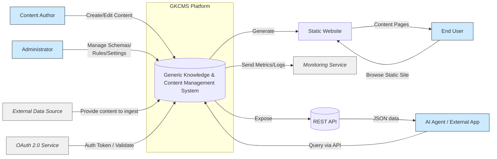
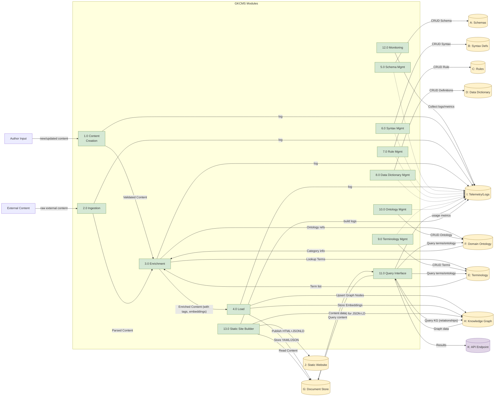
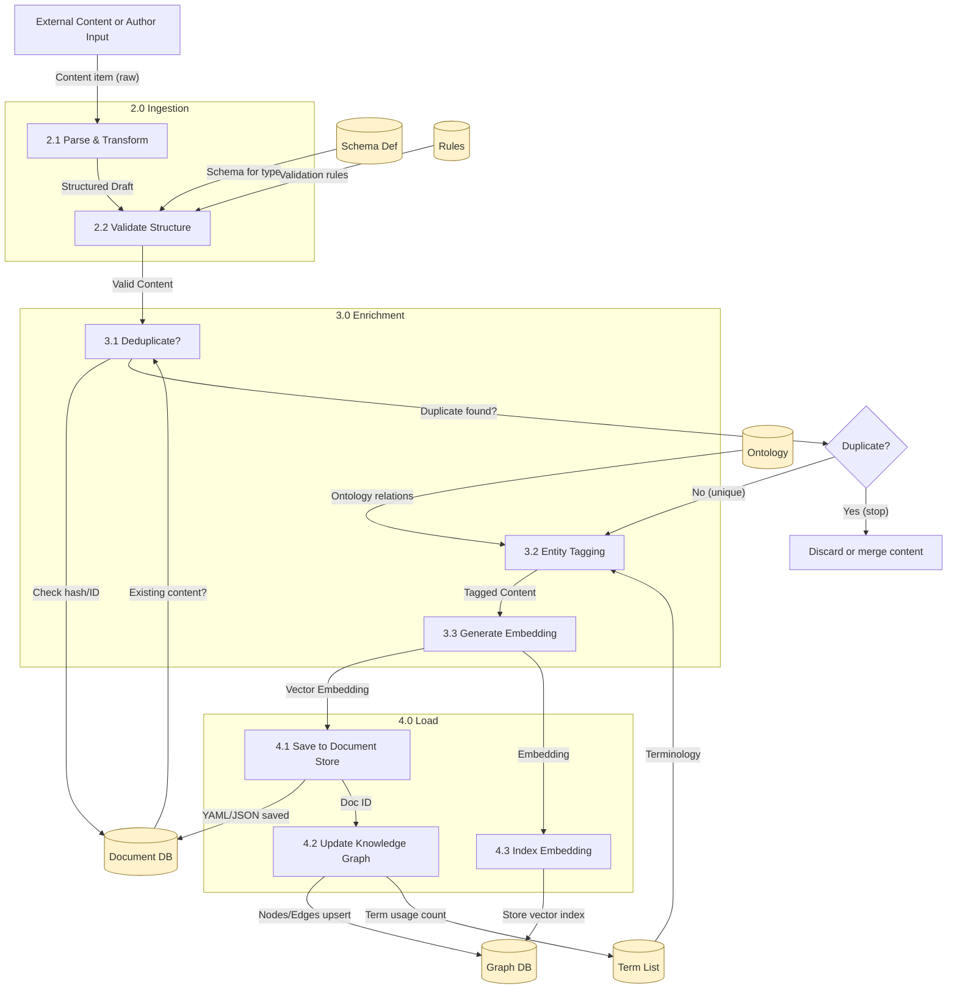
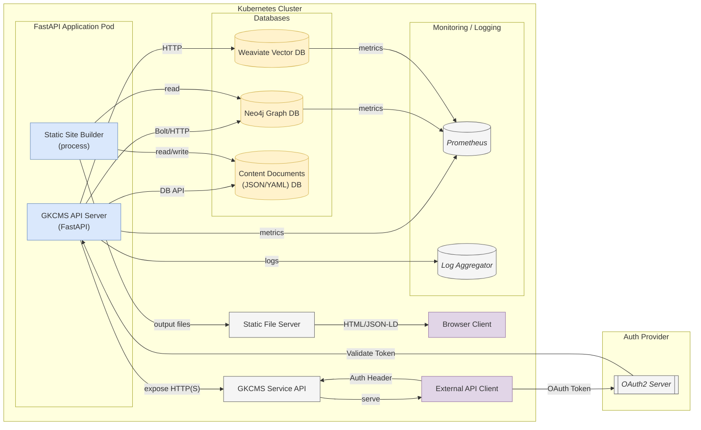
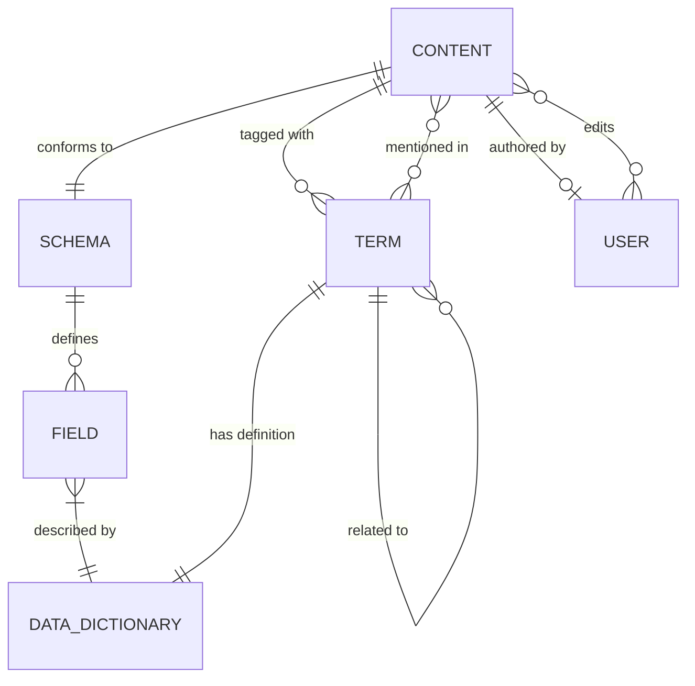

# System Requirements Specification (SRS)  
**Project:** Generic Knowledge & Content Management Platform (GKCMS)  
**IEEE 830 Compliant** - Version 1.0 - May 2025  

## Table of Contents  

1. **Introduction**  
   1.1 [Purpose](#11-purpose)  
   1.2 [Scope](#12-scope)  
   1.3 [Definitions, Acronyms, and Abbreviations](#13-definitions-acronyms-and-abbreviations)  
   1.4 [References](#14-references)  
   1.5 [Overview](#15-overview)  

2. **Overall Description**  
   2.1 [Product Perspective](#21-product-perspective)  
   2.2 [Product Functions](#22-product-functions)  
   2.3 [User Classes and Characteristics](#23-user-classes-and-characteristics)  
   2.4 [Operating Environment](#24-operating-environment)  
   2.5 [Design and Implementation Constraints](#25-design-and-implementation-constraints)  
   2.6 [Assumptions and Dependencies](#26-assumptions-and-dependencies)  
   2.7 [System Architecture and Workflow](#27-system-architecture-and-workflow)  
       - 2.7.1 [System Context Diagram](#271-system-context-diagram)  
       - 2.7.2 [Data Flow Diagram - Level 1](#272-data-flow-diagram--level-1)  
       - 2.7.3 [Data Flow Diagram - Level 2 (Content Pipeline)](#273-data-flow-diagram--level-2-content-pipeline)  
       - 2.7.4 [Deployment Diagram](#274-deployment-diagram)  
       - 2.7.5 [Core Data Model (Entity/KG) Diagram](#275-core-data-model-entitykg-diagram)  

3. **Specific Requirements**  
   3.1 [Functional Requirements](#31-functional-requirements)  
   3.2 [Non-Functional Requirements](#32-non-functional-requirements)  

4. **Appendices**  
   4.1 [Glossary of Terms](#41-glossary-of-terms)  
   4.2 [Acronyms and Abbreviations](#42-acronyms-and-abbreviations)  

---

## 1. Introduction  

### 1.1 Purpose  
The purpose of this document is to define a complete Software/System Requirements Specification (SRS) for the **Generic Knowledge & Content Management Platform (GKCMS)**. This platform is intended to manage structured content (in the form of "atomic containers') for use by both human users and AI agents. The SRS outlines the system's functionality, constraints, and quality requirements in compliance with IEEE 830 standards. It will serve as a reference for stakeholders (developers, testers, users, etc.) to understand what the system will do and the conditions under which it will operate.  

### 1.2 Scope  
The GKCMS platform enables an **author-first** (user-driven content creation) and **headless-first** (API-driven content management) workflow for managing structured content and knowledge. It will support content authoring, ingestion of external content, enrichment (metadata tagging and semantic embeddings), storage in multiple formats (YAML/JSON documents, vector database, and materialized knowledge graph), and delivery via both a static website and a RESTful API for external consumption. The scope of this SRS covers:  

- Functional capabilities including content schema management, validation rules, content creation interface, ingestion pipelines, content enrichment, static site generation with semantic markup, querying capabilities, and system monitoring.  
- Non-functional requirements such as performance (scalability and latency), extensibility (use of open-source components), portability (containerization), observability (logging, tracing, metrics), and security (adherence to OWASP ASVS Level 2, audit trails, RBAC).  
- System architecture description including main modules (Creation, Ingestion, Enrichment, etc.), data stores (schemas, rules, dictionaries, ontology, content storage, knowledge graph, etc.), and external interfaces (API, website, monitoring, authentication).  
- Constraints and assumptions, particularly differences between a local proof-of-concept deployment and a production deployment (e.g. authentication omitted in PoC but required in production).  

This SRS does **not** provide detailed design or implementation code; it focuses on requirements. Design diagrams are included to clarify system context, data flow, deployment, and data model, but they serve to illustrate requirements, not to dictate low-level design.  

### 1.3 Definitions, Acronyms, and Abbreviations  
- **Atomic Content Container (Container):** A fundamental unit of content managed by the system, consisting of structured data fields (stored in YAML/JSON) and associated metadata (including semantic vector embeddings and relationships in the knowledge graph). Each container has a unique ID, version, and provenance info (e.g. author or source).  
- **Schema:** A definition of a content type, including its structured fields and data types (comparable to a content model). Content containers must conform to a schema (also known as content type or template).  
- **Syntax Definition:** A set of rules or templates governing the format/markup of content items (e.g. a predefined syntax for how content is structured, possibly including templating or markdown usage rules).  
- **Rule:** A validation or business rule applied to content (e.g. ensuring required fields are present, or enforcing content quality constraints). Rules may be specific to a schema or global.  
- **Data Dictionary:** A repository of metadata about data elements. In this context, it provides definitions for structured data fields or business terms used in content. It ensures consistent meaning for fields across schemas (a data dictionary entry might describe what a field like "Title" means and how it's used).  
- **Terminology Store:** A controlled vocabulary of domain terms (keywords or phrases) that are relevant to the content domain. These terms could be topics, tags, or glossary terms that appear in content.  
- **Domain Ontology:** A structured representation of knowledge for the domain, often hierarchical (e.g. categories, sub-categories, and terms) and semantic relationships between terms. In this system, the ontology may be designed in an external tool (Protégé) but stored internally as nodes and relationships in the knowledge graph (e.g. "Category' and "Term' nodes with "subcategory-of' or "is-a' relationships).  
- **Knowledge Graph (KG):** A graph data representation that links content, terms, and concepts. The platform will "materialize' a knowledge graph, meaning content and ontology are stored as interconnected nodes/edges (e.g. a content container node linked to term nodes that it mentions, term nodes linked to category nodes, etc.).  
- **Static Site Builder:** The component that generates a static website (HTML pages, likely with JSON-LD embedded) from the content in the system for human browsing. JSON-LD is used to embed structured data (knowledge graph context) into pages for SEO and AI consumption.  
- **JSON-LD:** JavaScript Object Notation for Linked Data, a format to embed structured data in web pages. The platform uses JSON-LD in generated pages to expose the knowledge graph information (e.g. schema.org annotations) about content, which helps search engines and AI understand the content context [oai_citation:0‡yext.com](https://www.yext.com/platform/content#:~:text=).  
- **REST API:** The web service interface (based on HTTP/JSON, likely implemented via FastAPI) through which external applications or AI agents can query or manipulate content and knowledge in a headless manner.  
- **OAuth 2.0:** An industry-standard protocol for authorization. The platform will use OAuth 2.0 for securing the API in production (e.g. issuing tokens to clients and validating scopes/permissions).  
- **Provenance:** Metadata about the origin of a content item (who created it, when, and from what source).  
- **Embedding (Vector Embedding):** A numeric vector representation of content (usually generated by an AI model) that captures semantic meaning, enabling similarity search. The platform stores an embedding for each content container to support semantic search queries.  
- **Telemetry:** Monitoring data collected from the system, including logs, metrics, and traces of operations. Telemetry is used for observing system behavior and performance (e.g. capturing usage analytics, error rates, response times).  
- **RBAC:** Role-Based Access Control, a method of regulating system access based on roles assigned to users (e.g. author, admin, reader roles with different permissions).  
- **PoC:** Proof of Concept - a minimal deployment of the system used to verify concepts (in this case, a local deployment using open-source components).  

*Note:* Additional acronyms are listed in section [4.2](#42-acronyms-and-abbreviations). Terms specific to content management and knowledge graphs are further explained in the [Glossary](#41-glossary-of-terms).  

### 1.4 References  
The following documents and sources are referenced or provide context for this SRS:  

- IEEE Std 830-1998 - IEEE Recommended Practice for Software Requirements Specifications (for overall structure and best practices in requirements documentation).  
- OWASP Application Security Verification Standard (ASVS) 4.0.3 - particularly Level 2 requirements [oai_citation:1‡versprite.com](https://versprite.com/blog/software-development-life-cycle/#:~:text=Level%201%20%E2%80%93%20First%20step%2C,verify%20with%20black%20box%20testing) which define industry-standard security controls for "most applications'.  
- Quire Documentation on YAML & Markdown usage - illustrating how content is split between **YAML** for structured data and **Markdown** for narrative content [oai_citation:2‡quire.getty.edu](https://quire.getty.edu/docs-v1/fundamentals/#:~:text=Content%20is%20stored%20in%20two,top%20of%20every%20Markdown%20file), highlighting best practices in structured authoring.  
- Chris Diaz, *"Introduction to Static Site Generators'* - notes importance of correct **YAML** syntax in content front-matter and the need for validation, since "invalid YAML will break your website' [oai_citation:3‡chrisdaaz.github.io](https://chrisdaaz.github.io/static-web-scholcomm/tutorials/static-site-generators/#:~:text=YAML%20syntax%20is%20strict%3B%20invalid,an%20error%20you%20don%E2%80%99t%20understand).  
- Radview Blog, *"SLA for Performance and Load Testing'* - provides insight on how performance testing informs SLA definitions, noting that SLAs are **pre-defined performance goals** and test results are compared against them [oai_citation:4‡radview.com](https://www.radview.com/blog/in-the-spotlight-the-sla-for-performance-and-load-testing/#:~:text=Performance%20Testing%20%20has%20become,in%20Performance%20and%20Load%20Testing), and that performance tests establish baseline data for SLAs [oai_citation:5‡radview.com](https://www.radview.com/blog/in-the-spotlight-the-sla-for-performance-and-load-testing/#:~:text=application%20will%20perform%20under%20excessive,foundation%20data%20for%20performance%20SLAs).  
- Yext Platform, *Knowledge Graph* - explains the value of structuring content in a knowledge graph to improve search engine and AI discoverability [oai_citation:6‡yext.com](https://www.yext.com/platform/content#:~:text=).  

(Inline citations in the format 【source†lines】 correspond to these references and other external research sources used to justify requirements or decisions.)  

### 1.5 Overview  
The rest of this SRS document is organized as follows: **Section 2** provides a high-level description of the GKCMS system, its context, major components, and operating environment. This includes illustrative diagrams for context, data flow, deployment, and data models to help visualize the system architecture and workflows. **Section 3** enumerates the specific requirements - functional requirements detail the expected features and behaviors of the system, while non-functional requirements specify performance targets, security standards, and other quality attributes. Each requirement is labeled with a unique identifier (REQ-***###***) for traceability. **Section 4** contains appendices, including a glossary of key terms to clarify domain-specific language and an acronym list. The goal is to ensure clarity and completeness so that stakeholders and developers can proceed with design, implementation, and testing with a shared understanding of the system's requirements.  

## 2. Overall Description  

### 2.1 Product Perspective  
The GKCMS is a **new, standalone platform** that combines features of a traditional Content Management System (CMS) with a Knowledge Graph system. It can be seen as a central hub in which content is authored or ingested, enriched with semantic metadata, and then delivered to end users or applications. The system interacts with several external entities: human users (content authors, administrators, and consumers), external data sources (for content ingestion), AI agents or external applications (via API), and external infrastructure services (for authentication and monitoring). The figure in Section 2.7.1 shows the context of GKCMS relative to these external actors and systems.

Internally, GKCMS is modular, comprising multiple subsystems (modules) and associated data stores, labeled for reference as follows:  

- **Content Creation Module (1.0):** Provides user interfaces or endpoints for authors to create and edit content. This module ensures authoring is guided by schema (content type) templates and applies validation rules as content is written. It supports an "author-first' workflow where content is created manually in the system.  
- **Ingestion Module (2.0):** Handles import of content from external sources in a "headless-first' workflow. This might include parsing files or feeds, or receiving content via API for automated ingestion. It prepares external content to fit the system's schema and syntax requirements.  
- **Enrichment Module (3.0):** Processes content (whether authored or ingested) to enhance its value. Enrichment includes: deduplication (detecting and avoiding duplicate entries), entity tagging (identifying and linking key terms in content to the terminology/ontology), and embedding generation (creating vector embeddings for each content item for semantic search). The enrichment module may utilize AI/NLP services for entity recognition and embedding.  
- **Load Module (4.0):** Finalizes the content pipeline by storing the enriched content into the various persistence layers. This includes saving the content in the **Document Store (G)** in structured form (e.g. YAML or JSON files/DB documents), updating the **Knowledge Graph (H)** with new or updated nodes/relationships representing the content and its links to terms or other content, and indexing the content's embedding into a vector search index. Essentially, this is the "persist' step of an ETL (Extract-Transform-Load) pipeline.  
- **Schema Management Interface (5.0):** Allows administrators to Create, Read, Update, Delete (CRUD) content type schemas. Through this interface, new content structures can be defined or existing ones modified. The schemas are stored in the **Schema Store (A)** repository.  
- **Syntax Management Interface (6.0):** Allows management of syntax definitions or templates. It might include managing allowed markup or content templates (for example, managing a library of Markdown snippets or YAML templates that authors can use). These are stored in the **Syntax Store (B)**.  
- **Rule Management Interface (7.0):** Enables defining and managing validation rules or business rules that content must adhere to (beyond what the schema defines). Rules are stored in the **Rule Store (C)**.  
- **Data Dictionary Management (8.0):** Interface for curating the data dictionary - i.e. definitions for data fields or terms. The Data Dictionary is stored in repository **D**. This helps standardize field definitions across schemas and provides human-readable descriptions for each data element in the system.  
- **Terminology Management (9.0):** Interface to manage the terminology list - essentially the glossary of domain terms (in **Terminology Store (E)**). Admins can add or modify terms that are recognized in content (for tagging) or used in the ontology.  
- **Ontology Management (10.0):** Interface to manage the domain ontology (in **Ontology Store (F)**). This includes creating categories, sub-categories, and linking terms into the ontology hierarchy. It may integrate with external ontology design tools (like Protégé) for import/export, but internally stores the ontology structure as part of the knowledge graph.  
- **Query Interface (11.0):** Provides search and query capabilities for end-users or AI agents to retrieve content and knowledge. This could be a user-facing search UI on the website or an interactive query console for admins, and also encompasses query endpoints on the API. It leverages the Document Store, Knowledge Graph, and vector index to answer queries.  
- **Monitoring Module (12.0):** Handles system observability. It collects telemetry data (logs, metrics, traces) into **Telemetry/Logs store (I)** and may provide dashboards or alerts. It integrates with external monitoring tools (e.g. Prometheus for metrics scraping, and perhaps Grafana for dashboards) and ensures the system's health and performance can be observed.  
- **Static Site Builder (13.0):** Generates a static website (content pages in HTML, plus JSON-LD metadata) from the content in the system. The outputs are stored/deployed to the **Website repository (J)**. This could integrate with static site generators or custom templates to produce a site that end users can browse without needing the content editing interface. 

The data stores (A through K) mentioned above are logical components where different types of data persist:  

- **A. Schema Store:** Repository of content type schemas (definitions of structure for each content type). Could be in YAML/JSON format and possibly stored in a version-controlled manner.  
- **B. Syntax Store:** Repository of syntax or template definitions. May contain structured representations of content formatting rules or content templates.  
- **C. Rule Store:** Repository of content validation rules or business rules. These could be expressed in a rules engine or as configuration that the content validation engine uses.  
- **D. Data Dictionary:** Database or file store containing definitions of data fields and possibly business glossary terms (with descriptions, data types, allowed values).  
- **E. Terminology Store:** Database of domain-specific terms (keywords, tags, glossary terms). Could include synonyms or mappings. This is closely related to the ontology.  
- **F. Ontology Store:** Storage of the domain ontology graph (categories, subcategories, terms and their relationships). Likely this data is also mirrored in the knowledge graph database (H), but a portion might be managed separately or imported.  
- **G. Document Store:** The main content repository, storing the actual content containers. For example, this might be a NoSQL database or a set of files where each content item is stored as a YAML or JSON document (including the content's structured fields and possibly unstructured body text in Markdown/HTML).  
- **H. Knowledge Graph Store:** The graph database that holds the interconnected representation of knowledge. It contains nodes for content items, nodes for terms/categories (ontology), and edges representing relationships (e.g. "Content A mentions Term X' or "Term X is a subcategory of Term Y'). A graph database like Neo4j is envisioned here for its capabilities in handling complex relationships and queries.  
- **I. Telemetry/Logs Store:** Where system logs, audit trails, and metrics are collected. This could be a combination of log files, a time-series database for metrics, and tracing data. It supports monitoring and debugging.  
- **J. Website (Static Site) Store:** The output location for the static site files. In a deployment, this could be a directory served by a web server or a bucket for a static site host. It's considered a "data store' in that the static HTML/JS/CSS content is stored and served to end users.  
- **K. API:** Technically the API is an interface, but here "API store' can be interpreted as the API endpoint layer of the system. It's where the running API service (FastAPI) exposes content to external clients. (There is no data "stored' in the API, so K is more of a system interface than a data store, but it is listed for completeness of components).  

**Product Relationship to External Systems:** GKCMS does not replace existing CMS or knowledge bases but is a unique platform. It could, however, integrate with them. For instance, external content sources (like another CMS export or a data feed) can feed into GKCMS via the ingestion module. The static site output could be integrated into an organization's web presence (for example, publishing the static site to a company docs website). The knowledge graph could integrate with external AI systems via the API (e.g. allowing an LLM-based agent to query for facts or content in GKCMS). The system relies on an external identity provider (for OAuth 2.0) in production to handle authentication. It also leverages external monitoring (like Prometheus/Grafana or cloud monitoring services) to handle telemetry.  

Below is the system context diagram illustrating GKCMS and its interactions with users and external systems:

#### 2.7.1 System Context Diagram  

*Figure: System Context Diagram.* The GKCMS platform interacts with multiple actors: **Content Authors** create content through GKCMS's interface; **Administrators** configure schemas, rules, and other settings; **External Sources** supply content via ingestion pipelines; **AI Agents or client applications** consume content through the REST API (secured via an OAuth2 **AuthProvider** in production); **End Users** access published content via the generated **Static Website**; and a monitoring system collects **telemetry** from GKCMS.  

### 2.2 Product Functions  
At a high level, GKCMS provides the following key functions to fulfill the needs of its users and stakeholders:

- **Content Authoring and Editing:** Authors can create new content items or edit existing ones using a user-friendly interface. The interface enforces structure by letting the author select a content type (schema) and then providing a form or editor corresponding to that schema. The system validates the content in real-time or on submission against the schema and any defined rules, ensuring that the content is structurally sound before it's saved (REQ-002, REQ-003). The authoring interface may support writing content in **YAML** front-matter plus **Markdown** body (a common pattern), or directly in a structured editor. Given that *content is stored in two formats: YAML for data, and Markdown for narrative text* [oai_citation:7‡quire.getty.edu](https://quire.getty.edu/docs-v1/fundamentals/#:~:text=Content%20is%20stored%20in%20two,top%20of%20every%20Markdown%20file), the system will likely separate fields (YAML) from rich text (Markdown) content internally. A critical function here is **schema-validated authoring** - preventing authors from deviating from the defined content model.  

- **Schema and Configuration Management:** Administrators can define and modify the content model of the system through managing schemas, syntax rules, validation rules, and related configuration. This includes creating new content types (with fields, data types, and constraints), defining any content syntax or templates, and authoring validation rules (for example, a rule that no two content items can have the same title if uniqueness is required). These functions (modules 5.0, 6.0, 7.0, 8.0, 9.0, 10.0) ensure the platform is **extensible and customizable** to different domains. For instance, an admin might use the ontology management function to import or build a domain taxonomy (categories and terms), which will then be used for tagging content.  

- **Content Ingestion Pipeline:** The system can ingest content from external sources in an automated way (useful for bulk import or integrating with other systems). An admin or automated job can feed data (e.g. a batch of Markdown files with YAML front-matter, or JSON exports from another system) into the ingestion module. The ingestion function parses the input, maps it to the appropriate schema, and initiates the enrichment process. During ingestion, basic validation is applied to ensure the incoming data matches or can be transformed into the system's schemas. This function enables a **headless-first** workflow, where content could be created outside and then loaded in.  

- **Content Enrichment:** Once content is authored or ingested, the enrichment functions kick in. **Deduplication** checks if a similar content item already exists (by comparing key fields or using content hashes / embeddings to detect duplicates). **Entity tagging** automatically scans the content for known terms (from the terminology store) or named entities, and links them - for example, if "COVID-19' is a term in the terminology store, the enrichment might tag any mention of "COVID-19' in content and link it to that term's entry. This creates a rich linkage between content and the knowledge model. **Embedding generation** uses an AI model to generate a vector representation of the content's textual information; this vector is stored (likely in a vector database or as part of the knowledge graph index) to enable semantic searches (so that a search query can find relevant content even if it doesn't exactly match keywords). These enrichment steps greatly enhance content retrieval and analysis capabilities.  

- **Storage of Content and Knowledge:** The platform provides persistent storage for all aspects of content and knowledge. Content is stored in at least two forms: (1) as structured **YAML/JSON** documents (for precise retrieval and static site generation) and (2) as vector embeddings in a **vector index** for semantic similarity search. Additionally, content and its relationships are stored in a **graph database** (knowledge graph) to allow complex queries over relationships (e.g. find all content items that relate to a certain category or that were authored by the same person, etc.). This dual storage approach (document + graph + vector) ensures flexibility in retrieval: traditional exact queries, relational/graph queries, and AI-driven similarity queries are all supported. The concept of dual storage is aligned with modern knowledge systems where semantic search is combined with structured data management [oai_citation:8‡azumo.com](https://azumo.com/software-developer/weaviate#:~:text=Weaviate%20is%20an%20open,search%20and%20knowledge%20graph%20exploration) [oai_citation:9‡yext.com](https://www.yext.com/platform/content#:~:text=).  

- **Static Site Generation:** A core output of GKCMS is the ability to publish content as a static website. This function will take the content (from the document store and knowledge graph) and generate human-readable web pages (HTML). Each page corresponds to a content item or a content listing, and includes **JSON-LD metadata** embedding knowledge graph data (for example, marking up authors, dates, topics using schema.org vocabulary). By doing so, the static site is not only a human-facing product (e.g. documentation site or knowledge base) but also machine-friendly. Search engines and AI systems crawling the site can extract structured data from the JSON-LD, making the content more discoverable and useful [oai_citation:10‡yext.com](https://www.yext.com/platform/content#:~:text=). The static site builder might use frameworks like Jekyll, Hugo, or a custom generator integrated with GKCMS. It needs to handle Markdown to HTML conversion for any rich text fields. During this process, the system must ensure that the structured content is accurately represented and that any special formatting is preserved or transformed appropriately (which raises the consideration of **Markdown vs YAML validation** issues, see Section 2.5).  

- **Search and Query (Knowledge Retrieval):** The platform provides search functionality for end users (through the static site's search feature) and for API consumers. This includes full-text search on content, filtered search (e.g. by category or schema), and semantic search using embeddings. Because content is enriched with tags and connected to ontology terms, users can navigate or query by topics. The query interface might also allow querying the knowledge graph directly (for advanced use cases, possibly via a GraphQL or Cypher query endpoint for power users). For example, a user might query: "find all content items tagged with Term X and created after 2024' - the system would consult the graph and document store to answer that.  

- **API Access (Headless CMS capabilities):** All core content and knowledge management features are accessible via a RESTful API. This API allows external systems or scripts to perform CRUD operations on content (subject to authentication and authorization), query content or the knowledge graph, and possibly manage configuration (for admin-type API calls). This effectively makes GKCMS a **headless CMS**; an organization could use the API to pull content into a mobile app or integrate with other services. OAuth 2.0 is used to secure these API endpoints (so only authorized applications can access certain data). For instance, an AI chatbot could use an API token to query GKCMS for information in response to user questions.  

- **Monitoring and Analytics:** The platform includes monitoring of its own operations. This entails logging every significant action (with trace IDs to correlate events - e.g., an ingestion job's steps, user edit actions for audit trail, etc.), collecting performance metrics (like request rates, response times, memory/cpu usage), and exposing these metrics in standard formats (such as Prometheus). The system assures **99% traceability**, meaning virtually all transactions can be traced end-to-end via logs or distributed traces - if a content publish fails, the logs/traces will show where and why. This is critical for debugging the pipelines (ingestion/enrichment) and ensuring content integrity. Additionally, the system tracks usage metrics (like number of reads, popular search terms, etc.) as part of telemetry. These insights can help content managers understand engagement and can also feed into KPIs.  

Security features (though largely non-functional) also manifest as product functions: enforcement of **RBAC** on the interfaces (so only admins can manage schemas, only authenticated users/agents with appropriate roles can post content via API, etc.), and maintenance of **audit logs** for content changes (who changed what and when). The product also includes periodic backups or export functions (not explicitly listed in modules but implied under reliability/maintainability) - content and configurations can be exported (for example, all content as YAML, or the knowledge graph as a JSON-LD graph dump) to avoid vendor lock-in.  

To summarize, GKCMS functions as an integrated **knowledge-centric content hub**: it not only manages content like a CMS but also enriches it into a knowledge graph. It ensures content quality through schema and rules, enhances findability via semantic enrichment, and delivers content in multiple ways (static site for humans, API for machines). The next sections will detail the requirements that realize these functions.  

### 2.3 User Classes and Characteristics  
Different categories of users (or system actors) will interact with GKCMS, each with specific needs and technical backgrounds:

- **Content Authors (Users):** These are subject-matter experts or content writers who use the platform to create and update content. They are usually non-technical or semi-technical users. They need a **user-friendly authoring interface** that might resemble a rich text editor or form. They are concerned with easily inputting content, adding media if needed, tagging content with the right terms, and seeing previews of how the content will look on the site. They rely on the system to validate their input (so they don't have to worry about YAML syntax intricacies or schema details). Authors might be aware of basic Markdown for formatting text but should not be required to troubleshoot structural errors - the system should guide them. They do not directly interact with YAML files or the database; everything is through the UI or maybe a desktop editor if the system supports content import. Their technical skill: moderate; main goal: produce high-quality content efficiently.  

- **Administrators (Admins):** These users manage the configuration of the platform. They define schemas (content types), decide what fields content should have, set up validation rules (like "all BlogPost must have at least one Category'), manage the dictionary of terms and ontology to reflect the domain knowledge. They often have a more technical background and understanding of data modeling. Admins might also be responsible for managing user accounts/roles if needed. They require interfaces that might be more complex (e.g. a schema builder UI, forms to input ontology relationships, etc.). They need to ensure consistency and will use the platform's management interfaces extensively. They also care about the platform's health, so they might use monitoring dashboards to see system status. Technical skill: high; main goal: configure the system to represent the knowledge domain and enforce content standards.  

- **End Users (Consumers/Readers):** These are the people who ultimately consume the content, typically via the static website (or possibly via the API if they are developers integrating the content). They do not log into GKCMS directly. Instead, they experience the content that GKCMS publishes. Their concern is that the content is easily discoverable (search works well), the site is fast and available, and the information is accurate and up-to-date. They benefit indirectly from GKCMS features like JSON-LD (which can improve search engine results for the site, helping end users find the content). If the static site includes interactive search (like a search box for the knowledge base), they use that, which calls GKCMS's query interface behind the scenes. End users may range from general public readers to internal employees, depending on the deployment of the site. Technical skill: low; main goal: find and read content.  

- **External Application Developers / AI Agents:** This class includes any system or developer that uses the GKCMS API. For example, an AI agent (like a question-answering bot) might query the GKCMS to retrieve relevant content to feed into an answer. Or a mobile app might pull content from GKCMS to display to users within the app. These users interact through machine interfaces (REST API, possibly GraphQL or other if implemented). They need comprehensive API documentation, stable endpoints, and secure access (OAuth tokens). They also care about performance (the API should respond quickly) and reliability. Technical skill: high (developers); main goal: programmatically utilize the content/knowledge managed by GKCMS, possibly in real-time scenarios (e.g. an AI agent retrieving answers).  

- **System Operators/DevOps Engineers:** These are not end-users of the content but are responsible for deploying and maintaining the GKCMS application (particularly relevant if the system is self-hosted by an organization). They will use Docker/Kubernetes to deploy the system, monitor resource usage, and ensure uptime to meet SLAs. They interface with the system through logs, monitoring endpoints (Prometheus metrics), and admin tools. They need the system to be container-friendly and to expose health checks. Technical skill: very high; goal: keep the system running smoothly, scalable, and secure.  

Each user class has distinct usage scenarios, which the requirements must accommodate. For instance, authors should not be bothered with raw YAML editing unless they choose to; the system might have behind-the-scenes YAML but surface a nicer interface. However, for the PoC, authors might actually edit YAML files directly or through a simple text area - but this would be refined in production tools. Similarly, admins might need to import an ontology from Protégé - the system should allow importing an OWL or TTL file to populate the ontology store, or provide UI to manually input it. External developers might request new API endpoints if needed (for example, maybe initially only GET (read) APIs are available, but later there might be need for POST (write) via API which then must obey rules, etc.). 

The user classes and their characteristics guide many of the usability and accessibility requirements (e.g., UI must be intuitive for authors, API must be well-documented for developers, etc.) which will be detailed in the requirements section. 

### 2.4 Operating Environment  
The GKCMS is envisioned as an application that can run on modern servers or cloud environments, containerized for ease of deployment. The primary technologies and environment considerations are:  

- **Open-Source Stack:** The application will be built with open-source technologies, primarily using **Python** for the backend logic (FastAPI framework for the web API and possibly web UI). This choice ensures extensibility and a broad community support. The knowledge graph database will likely be **Neo4j** (a popular graph DB suitable for ontology and content networks), and the vector search capability will be provided by a vector database like **Weaviate**. Weaviate is an open-source vector search engine that also has knowledge graph features [oai_citation:11‡azumo.com](https://azumo.com/software-developer/weaviate#:~:text=Hire%20Nearshore%20Weaviate%20Developers%20,search%20and%20knowledge%20graph%20exploration), making it well-suited to integrate semantic search with structured data. In our architecture, Neo4j will handle the rich graph queries and relationships, while Weaviate (or an equivalent) will handle high-performance vector similarity queries. The Document store could be something like a lightweight NoSQL database (e.g. MongoDB or even just Git-managed YAML files for PoC). All these components are open-source, aligning with an extensibility ethos.  

- **Hardware and OS:** The platform is server-based. In a PoC or small deployment, all components could run on a single machine (e.g. a Linux server running Docker containers for the API, Neo4j, Weaviate, etc.). In production, it might be distributed: e.g., Kubernetes cluster running multiple instances of the API (to handle ~400 concurrent users as required), a Neo4j cluster for resilience, etc. The system should be OS-agnostic to an extent (Docker ensures this). It will likely run on Linux (the most common environment for these tools). The static site can be served via any web server or CDN (Nginx, Apache, or cloud object storage).  

- **External Services:** The OAuth 2.0 provider is external - perhaps Auth0, Keycloak, or the organization's SSO. The GKCMS will integrate with it by verifying tokens on API requests but will not run the identity service itself. Monitoring expects an external Prometheus to scrape metrics and possibly an ELK stack or similar for logs. Thus, GKCMS provides endpoints (like `/metrics`) and log output, but the actual storage and visualization might be handled externally.  

- **Development and Testing Environment:** The system will be developed using Python, so it will need a Python runtime (likely 3.10+ for FastAPI). Unit and integration testing might use Docker Compose to spin up the environment (API + Neo4j + Weaviate, etc.). The PoC environment is "local', meaning minimal nodes (maybe even without full auth, and minimal data). Production environment will consider load (the requirement of 10k writes/min suggests an environment with possibly multiple API instances and a robust DB setup).  

- **Deployment Environment:** The system is intended to be portable via Docker containers. For example, one container for the FastAPI application, one for Neo4j, one for Weaviate, etc. A Kubernetes deployment YAML or Helm chart would orchestrate these in production. The static site builder might run as a job or sidecar container that writes to a volume or cloud storage bucket. The environment must support container orchestration; a production scenario might run on a cloud Kubernetes service or on-premises cluster. The requirement of Kubernetes support (portability) means no component should be tied to a specific host environment - e.g., use environment variables for config, avoid assumptions about local file paths (use volumes), etc.  

- **Network:** GKCMS (API) will listen on HTTP/HTTPS (in production, behind a TLS termination proxy for HTTPS). It will communicate with Neo4j (bolt or HTTP protocol) and Weaviate (HTTP) over an internal network. In cloud or cluster, these should be in a secure network or namespace. The static site might be delivered over a CDN or simple static server. The monitoring communications (Prometheus scraping / pushing metrics, log shipping) should be considered as well.  

- **Compliance Environment:** If used in certain domains, GKCMS might operate under compliance requirements (not explicitly stated, but security suggests it should meet at least OWASP ASVS L2). That means the operating environment should be hardened (regular OS updates, container images without vulnerabilities, etc.). Also, since content could be sensitive, if deployed internally, the environment might be within a corporate firewall or VPC.  

- **Browser Compatibility:** The static site (which is the main user-facing component for end-users) must be compatible with modern web browsers. The authoring/admin UI (if web-based) should also support modern browsers and possibly have a responsive design (not a strict requirement here, but typically needed).  

In summary, the operating environment is a **containerized microservice environment** comprising the GKCMS app and supporting databases, capable of running on local or cloud infrastructure. It will be configured and scaled according to the specified performance needs (see Non-Functional Requirements for specifics like "≥10k writes/min').  

### 2.5 Design and Implementation Constraints  
The design of GKCMS is influenced by several constraints and choices:

- **Standards and Protocols:** The system will adhere to **RESTful API standards** for its external API, using JSON payloads. It will also adhere to **OAuth 2.0** standards for auth (likely the "Bearer token' scheme for API requests). For content metadata, using **JSON-LD** means following W3C's JSON-LD 1.1 spec, and likely schema.org vocabulary for content where appropriate (to maximize SEO and AI understanding).  

- **Technology Constraints:** We have committed to an open-source toolchain. Specifically, **FastAPI** (a Python web framework) for implementing the API and possibly server-side rendering if needed. The database choices (Neo4j and Weaviate) mean we design the data models to fit those: e.g., Neo4j stores nodes/relationships so content and terms need unique identifiers and a clear schema within the graph (maybe labels like :Content, :Term, etc.). Weaviate's use imposes that content and terms might also exist as "objects' in Weaviate with vector properties - we might need to keep Neo4j and Weaviate in sync or use Weaviate's hybrid search capabilities if we integrate the knowledge graph into it.  
  Another constraint: **Docker** and **Kubernetes** as target deployment means writing 12-factor style apps (externalizing configuration to env vars, etc.), handling statelessness in the API (so it can scale horizontally), and using persistent volumes for databases.  

- **Data Constraints:** The system must handle **both YAML and Markdown** content. One known issue is validation when authors use Markdown inside YAML (for example, if an author wants to include richly formatted text in a YAML field using the `|` multiline syntax). YAML is whitespace sensitive and certain characters (colons, quotes) can break it easily [oai_citation:12‡chrisdaaz.github.io](https://chrisdaaz.github.io/static-web-scholcomm/tutorials/static-site-generators/#:~:text=YAML%20syntax%20is%20strict%3B%20invalid,an%20error%20you%20don%E2%80%99t%20understand). This has been a source of errors in many static site setups (where a stray colon in YAML without quotes causes a build fail). We must design robust validation or editing experiences to mitigate this. One approach is to restrict authors from needing to write raw YAML - instead provide form fields that generate YAML behind the scenes. If authors do write Markdown, it should typically be in the body of content (separate from YAML front-matter). The system should validate the YAML front-matter or structured fields using a schema (possibly a JSON Schema validation) to catch errors early [oai_citation:13‡ndumas.com](https://ndumas.com/2023/06/validating-yaml-frontmatter-with-jsonschema/#:~:text=I%20had%20is%20that%20most,content%20of%20a%20YAML%20document). We know *YAML syntax is strict and invalid YAML can break the site* [oai_citation:14‡chrisdaaz.github.io](https://chrisdaaz.github.io/static-web-scholcomm/tutorials/static-site-generators/#:~:text=YAML%20syntax%20is%20strict%3B%20invalid,an%20error%20you%20don%E2%80%99t%20understand), so during content save or ingestion, the system should run a YAML parse/validate (and report meaningful errors). Also, if authors use Markdown in content body, we should sanitize or ensure it doesn't accidentally contain YAML-like sequences that confuse the parser. This interplay of Markdown/YAML is a constraint we acknowledge; the design might opt to store content in pure YAML (all fields, including a field that holds Markdown text). In such case, need to properly quote or use `|` for multi-line text, and maybe automatically escape problematic characters in that text when serializing to YAML. Alternatively, the content could be stored in JSON (which has no ambiguities with colons/quotes) internally, and then output to a Markdown+FrontMatter format only when needed for static site. Tools exist to validate YAML front matter with JSON Schema [oai_citation:15‡ndumas.com](https://ndumas.com/2023/06/validating-yaml-frontmatter-with-jsonschema/#:~:text=This%20is%20a%20project%20I%E2%80%99ve,content%20of%20a%20YAML%20document), and we will incorporate such techniques.  

- **Scalability Constraints:** We have a requirement to handle **10,000 container writes per minute**. This is a significant rate - the design must avoid bottlenecks. It implies concurrency (likely multiple ingestion threads or workers). Using Python, one constraint is the GIL (Global Interpreter Lock) which can limit multi-threaded CPU-bound tasks. We might employ multi-processing or an async approach for I/O bound tasks. The architecture likely needs to queue ingestion or use streaming writes to DB. Also, Neo4j and Weaviate must be configured to handle that write throughput - possibly by batching transactions or scaling cluster. For reads, ≤150ms latency constraint means caching might be needed (or just ensure DB queries are optimized, use indexing, etc.). The system design must consider eventual consistency between the document store and KG if necessary to achieve throughput (maybe writes go to one and the other is updated asynchronously). Also, supporting **400 concurrent users** means our API and static site must be tuned (the static site should handle that easily if on CDN; the API needs to be load-balanced with enough workers/instances).  

- **Extensibility & Modularity:** Being open-source and extensible means the design should allow plugging in new components or replacing parts. For example, if someone wants to use a different vector DB or if they want to add a new enrichment step (like content classification), it should be feasible. This constraints us to loosely couple components - e.g., communicate via clear interfaces or use an internal event bus. For the PoC, though, simplicity might prevail (function calls rather than a full message queue). But we should design modules so that one can be modified without heavy impact on others (e.g., adding a new data store for caching doesn't break existing code).  

- **Security Constraints:** OWASP ASVS Level 2 imposes certain design constraints: we must implement **secure authentication** (OAuth 2.0 flows, no plain text passwords, etc.), **strong access control** (authorize every request based on user role and data ownership), **input validation** to prevent XSS/Injection (e.g., sanitizing any HTML in content, parameterizing queries to Neo4j to avoid Cypher injection, etc.), **secure configurations** (no default passwords in DB, proper TLS), and so on [oai_citation:16‡versprite.com](https://versprite.com/blog/software-development-life-cycle/#:~:text=Level%201%20%E2%80%93%20First%20step%2C,verify%20with%20black%20box%20testing). We must also ensure an **audit trail** - meaning design must include logging of security-relevant events (logins, schema changes, content modifications). Audit logs might be stored in Telemetry store and must be tamper-evident (perhaps append-only or with integrity checks). Furthermore, using third-party libraries means we track their updates to patch vulns (the open-source constraint means we rely on community updates; as a design, possibly make it easy to update these components).  

- **Usability Constraints:** The UI (for authors/admins) should be web-based (to be accessible widely). This means front-end constraints: likely use a standard web tech (HTML/JS). Perhaps using a JS framework (React/Vue) for a smooth admin UI is expected. If so, design might be constrained by needing to implement API endpoints that the JS frontend can call (i.e., even the admin UI might be a separate single-page app consuming the same REST API). For PoC, maybe a minimal UI or direct file editing is fine, but for production, a proper UI is needed. We plan for it even if not fully implemented in PoC.  

- **Integration Constraints:** Integration with Protégé (for ontology import) suggests we might constrain the ontology format to OWL/RDF. Possibly the system will need to accept an OWL file and convert it into internal nodes. This could constrain us to certain ontology features or require using libraries for parsing OWL. If this is complex, an alternative is expecting admins to export CSV of terms and relationships, etc., but ideally direct OWL support is there.  

In summary, constraints arise from performance targets (which push a scalable, distributed design), technology choices (which push certain data modeling and interfacing patterns), and content format (necessitating robust YAML/Markdown handling). The design documented in architecture diagrams (Section 2.7) reflects these constraints by showing multiple integrated components and the flow of data among them. 

### 2.6 Assumptions and Dependencies  
Throughout this SRS, we make a few assumptions and note external dependencies:

- **Open-Source Components Availability:** We assume that Neo4j, Weaviate, FastAPI, etc., are available and appropriate for use. The project depends on these communities for updates (e.g., bug fixes in those platforms). If any of these were to become untenable (license change, performance issue), we assume we can find alternatives (e.g. use a different vector DB, or use an alternative graph store like JanusGraph, etc.). For now, the design leans on these specific tools due to their strengths (Neo4j for rich graph queries, Weaviate for combined vector+filter search [oai_citation:17‡azumo.com](https://azumo.com/software-developer/weaviate#:~:text=Hire%20Nearshore%20Weaviate%20Developers%20,search%20and%20knowledge%20graph%20exploration)).  

- **Proof-of-Concept vs Production Differences:** We assume that the initial PoC deployment will be local and possibly without full security. For example, we will **not require authentication in the PoC environment** to simplify testing (all users are trusted or it's a closed environment). However, we assume that when moving to production, an OAuth2 identity provider will be configured and all API calls will require valid tokens. We also assume that enabling this later is straightforward (the code will include hooks for auth, just not enforced in PoC config). Similarly, PoC might run everything on one node with minimal data, whereas production might distribute components. We assume linear scalability (that adding more instances will linearly increase throughput up to a point, which should hold given stateless API and horizontally scalable DB nodes).  

- **User Behavior Assumptions:** We assume authors will generally use the provided UI and not try to circumvent validation (like editing content database directly). This is important because our validation (schema/rule enforcement) is at the application level. If someone bypasses it (like manually editing the DB), they could introduce invalid content. In production, access to the DB is restricted, so this assumption is fine.  

- **Ontology Design Assumption:** The ontology imported via Protégé is assumed to be fairly tree-structured (category/subcategory/term as described). We assume it doesn't include extremely complex OWL constructs that we can't represent in a simple graph (for instance, if there were ontology logical rules or properties, we might not support all of that). We will represent the ontology as simple hierarchy and associative relationships in Neo4j. If the domain needs more, it might be out of scope.  

- **Concurrent Usage Assumptions:** The requirement mentions 400 concurrent users, 10 AI agents, and 1 ingestion job at a time. We assume that 400 concurrent human users are mostly browsing or searching the static site (which offloads query load mostly to the static site or cached API queries), meaning the system (API/DB) is not hammered by 400 heavy writes at once. The 10 AI agents might be performing queries concurrently though - but still read-heavy. The 1 ingestion job at a time suggests we won't have multiple bulk imports running simultaneously (which simplifies ensuring consistency and avoiding race conditions in enrichment). This assumption means we may not need a complex job scheduler to coordinate multiple ingestions - one at a time is acceptable.  

- **Performance Baseline and Scaling:** We assume that the 10k writes/minute is a target peak load for content creation (which could be ingestion). We will design to that, but we assume average load is much lower (maybe normal operations see far fewer writes, and this number is for, say, an initial bulk load or an extreme scenario). We depend on being able to do partial updates (like only update certain indexes after bulk load or disable some expensive checks during bulk ingestion if needed). We assume the underlying DBs can handle this with proper configuration (e.g., Neo4j can do ~hundreds or thousands of writes per second with batch commits; Weaviate can batch vectors etc.). If not, we might rely on scaling out or adjusting consistency (e.g. eventually consistent updates to KG).  

- **KPI/SLA Determination:** We assume that initial KPI targets (like latency, throughput, uptime) will be refined through testing and real usage data. We plan to set baseline metrics by conducting performance tests under expected loads, and then define SLAs accordingly (for instance, if tests show we can comfortably do 12k writes/min, we set SLA at 10k to have headroom). We depend on the availability of performance testing tools and realistic data volumes to simulate this. The Radview reference suggests using performance test results as foundations for SLAs [oai_citation:18‡radview.com](https://www.radview.com/blog/in-the-spotlight-the-sla-for-performance-and-load-testing/#:~:text=application%20will%20perform%20under%20excessive,foundation%20data%20for%20performance%20SLAs); we assume we will follow that approach - meaning the SLA numbers in this document (10k/min, 150ms, 99% trace, etc.) are initial goals and will be validated and possibly adjusted once we have empirical data in staging.  

- **Static Site Content Delivery:** We assume that the static site, once generated, will be delivered via a reliable mechanism (like an AWS S3 + CloudFront or GitHub Pages, etc.). That environment is expected to provide high uptime and low latency globally, which complements our system's availability (since even if the GKCMS API is down for maintenance, the static site can still serve content). We assume the static site only updates when content is changed or on a schedule (not continuously every second), so generating it is not a constant heavy load, but a periodic task. 

- **Backup and Recovery:** We assume that standard backup procedures will be followed (e.g., regular dumps of Neo4j and the document store, vector index regeneration if needed). The system design might include an export function (not in requirements explicitly, but good practice).  

In terms of dependencies: GKCMS depends on the correct functioning of external services like the identity provider (for secure mode) and the monitoring stack for alerting. If those are misconfigured or unavailable, GKCMS can still function in core content management, but security/observability might be compromised. We assume those external pieces are in place in production.  

Finally, we assume stakeholder support for the open-source approach - i.e., that using and contributing to open-source is acceptable and no requirement to use proprietary CMS or DBs emerges. The community-driven development can be an asset for extensibility and longevity of the project.  

With these assumptions clarified, we proceed to illustrate the system architecture and then the detailed requirements. Any changes in assumptions (like a need to support multiple simultaneous ingestion jobs, or much higher concurrency) would necessitate revisiting some requirements and design decisions.  

### 2.7 System Architecture and Workflow  
This section provides an overview of how the GKCMS components work together, via a series of diagrams.

#### 2.7.2 Data Flow Diagram - Level 1  
The following data flow diagram (DFD) shows the major processes (modules 1.0-13.0) of GKCMS and how data flows between processes and data stores (A-K). It represents a high-level (Level 1) view of the system's internal operations:

*Figure: DFD Level 1.* This diagram depicts how content flows through GKCMS: Content can enter via **Content Creation (P1)** or **Ingestion (P2)**. Both feed into the **Enrichment process (P3)**, which uses the Terminology (E) and Ontology (F) data to tag content and produce embeddings. The enriched content is then passed to **Load (P4)**, which writes data into the Document Store (G) and updates the Knowledge Graph (H). Meanwhile, administrators manage schemas, syntax rules, validation rules, data dictionary, terminology, and ontology via processes P5-P10 which directly update their respective stores (A-F). The **Static Site Builder (P13)** pulls content from the Document Store (G) and contextual info from the Knowledge Graph (H) to produce the static site (J). The **Query Interface (P11)** services user queries or API calls by retrieving data from the Document Store and Knowledge Graph (and references from E/F if needed), then returns results via the API endpoint (K) to the requester. **Monitoring (P12)** aggregates logs and metrics from various processes into the Telemetry store (I).  

This high-level flow ensures all modules interact in a controlled manner: for example, authors indirectly cause updates to G and H via the pipeline 1.0→3.0→4.0, and any schema changes in A would influence how P1/P2 validate content, etc.  

#### 2.7.3 Data Flow Diagram - Level 2 (Content Pipeline)  
The next diagram zooms into the content processing pipeline, detailing sub-processes within Ingestion, Enrichment, and Load (processes 2.0, 3.0, 4.0 from above). This is a DFD Level 2 focusing on how a single content item goes from raw input to fully stored and indexed:

*Figure: DFD Level 2 for Content Pipeline.* When content comes in (from an author or external source), **2.1 Parse & Transform** (P2.1) will convert it into the internal representation (e.g., parse front-matter, map fields to schema structure). Then **2.2 Validate Structure** checks it against the Schema (A) and any Rules (C). If the content fails validation (missing required fields, field types mismatch, or rule violation), it would be rejected or sent back for correction (not explicitly shown, but it would loop back to the author or log an error for ingestion). Once valid, the content goes to **3.1 Deduplicate** which queries the Document Store (G) to see if an item with the same title or checksum exists. If a duplicate is found, the process might stop or mark the content as needing review (in practice, perhaps it updates the existing content or discards the new one as shown). Assuming it's unique, **3.2 Entity Tagging** takes the content text and scans for occurrences of known terms (E) or matches to ontology patterns (F) - for instance, if ontology knows "Python' is under category "Programming Language,' the text "Python' gets tagged with that term. The output is content annotated with tags or links (like adding a list of term IDs that were found). Then **3.3 Generate Embedding** runs an AI model to produce a vector representation of the content (the text). That embedding plus the tagged content are passed to the Load phase. **4.1 Save to Document Store** writes the structured content (with tags, etc.) to the Document DB (G). It might also assign a unique ID if not already assigned. **4.2 Update Knowledge Graph** then creates/updates nodes: a content node in Graph DB (H) with relationships to term nodes (if content has tags, create relationships "CONTENT -> TERM') and other metadata relationships (like "CONTENT -> SCHEMA' if we model that, or author info). The ontology (F/E) might also get updated counts or new entries if a new term was discovered (though likely new terms wouldn't be auto-added without admin approval, so mostly it would increment tag usage counts or create link edges). **4.3 Index Embedding** stores the embedding vector in the vector index (which for simplicity we depict as part of H's functionality). In practice, H might represent two physical stores: Neo4j for graph and Weaviate for vectors, but conceptually it's knowledge index. After this pipeline, the content is fully stored and ready for querying and site generation.  

This pipeline ensures that by the time content is saved: it is valid, unique, enriched with knowledge, and efficiently searchable (via text or semantic similarity). We also highlight that any point can log telemetry (not drawn to avoid clutter, but each step could log success/failure to I). The decision diamond for duplicates shows a possible branch where duplicate content is handled gracefully (the requirement might be to not allow exact duplicates, or to merge them).  

#### 2.7.4 Deployment Diagram  
The deployment diagram below outlines a possible production deployment of GKCMS components on a Kubernetes cluster. It shows how the software pieces map to deployment units (containers, pods, etc.) and their communication.  

*Figure: Deployment Diagram.* The GKCMS API Server runs in one or more containers (within an "App Pod'), likely alongside a Static Site Builder process or job container. The API server interacts with the **Neo4j** and **Weaviate** databases and a **Document Store** (which could be a database or even a shared file system). In Kubernetes, these could be separate pods for each database, possibly managed by their own operators (Neo4j cluster, etc.). There is a Kubernetes Service that exposes the API to external clients (with HTTPS termination). External API clients must first obtain an OAuth token from an Auth Server and include it in requests; the GKCMS API server validates these tokens (either by introspection or signature, via the Auth Server). The Static Site Builder writes out files to a location that a web server (or static storage bucket) serves - this is shown as writing to DocStore (if DocStore is file-based, e.g. a shared volume) and a separate **WebServer** serving it to end users. Alternatively, StaticBuilder might directly deploy to a CDN. Monitoring components like Prometheus scrape metrics from API and DBs, and a log aggregator collects logs for analysis. The diagram shows logical communications: for instance, Prometheus might run outside the cluster or as a pod, scraping `/metrics` endpoints on the API and DB pods. The log agent could be Fluentd or similar shipping logs to ELK. The main point is that the application and DBs are containerized and interact over the network, and the system is designed to be horizontally scalable (we can run multiple AppPod replicas behind the service to handle more load). Docker containerization ensures **portability** - the whole stack can be run in different environments with consistent behavior.  

For the PoC deployment (not explicitly shown), all these might run on one VM or docker-compose, possibly without the AuthSystem and with minimal monitoring. But this deployment diagram represents the target production setup aligning to requirements: it shows separation of concerns (API vs DB vs static serving), use of Docker/K8s (for portability), and integration with auth and monitoring (for security and observability).  

#### 2.7.5 Core Data Model (Entity/KG) Diagram  
Lastly, we present an entity relationship model for the core concepts stored in the knowledge graph and content store. This combines the content model and ontology model. 

*Figure: Entity Relationship Model (simplified).* Key entity types: **Content**, **Schema**, **Field**, **Term**, **User**, **DataDictionary**. A **Content** item conforms to exactly one Schema (each content has a content type) [oai_citation:19‡thedatamaven.net](https://thedatamaven.net/2017/04/whats-the-difference-glossary-dictionary-taxonomy-ontology/#:~:text=A%20Data%20Dictionary%20is%20an,will%C2%A0include%20semantic%20name%20and%20definition). Each Schema defines one or many Fields (with Field names and types usually standardized via Data Dictionary). A Field is described by a Data Dictionary entry (for consistency of meaning across schemas, e.g. multiple schemas can have a field "Title' which refers to the same dictionary definition). **Term** entities represent glossary/ontology terms. A Term can have a definition in the Data Dictionary (especially if terms are also treated as glossary entries) - in many cases, business glossary and data dictionary overlap [oai_citation:20‡alation.com](https://www.alation.com/blog/data-dictionary-vs-business-glossary/#:~:text=Data%20Dictionary%20vs,business%20teams%20around%20a), so we depict that a Term may have one definition entry. Terms can have hierarchical relationships to other Terms (the "parent_of' self-relationship), which is how categories and subcategories are represented (a Category is simply a Term that has child Terms). Terms may also have lateral "related_to' relationships (for non-hierarchy associations, e.g. synonyms or see-also links). Content items can be tagged_with multiple Terms (and a Term can tag multiple contents, that is many-to-many). The relationship "mentioned_in' is the inverse: it shows Terms are mentioned in Content - effectively the same link as tagged_with but from the Term's perspective. We also include **User** entity to represent authors or editors; a Content is authored_by one User (for provenance), and users can edit multiple contents. The Data Dictionary likely contains entries for field definitions, but we also allow that it can store definitions for terms so it can serve as a unified glossary repository if needed. 

In the Knowledge Graph (H), we would implement this model: Content nodes, Term nodes, Schema nodes, etc., with edges for these relationships. For example, a Content node (id "article123') would have an edge "conforms_to' to a Schema node "ArticleType', edges "tagged_with' to Term nodes like "Machine Learning' or "Python', and an edge "authored_by' to a User node representing the author. The Term "Machine Learning' might have parent "Artificial Intelligence' (Term hierarchy), and might have a DataDictionary entry giving a description. 

This model ensures that queries can traverse, say, from a Term to all Content items that mention it, or from a Content to its Schema and then to definitions of each field (if needed for auto-generating documentation of content structure). The vector embeddings are not shown here as separate entities - likely the embedding is an attribute of Content or a separate index keyed by content ID. If we considered an "Embedding' entity, it would be one-to-one with Content, so not much need to depict it separately. Instead, the vector is stored in Weaviate keyed by content ID (and Weaviate itself can store some class schema, but that's a technical detail hidden from conceptual ER model). 

This ER diagram guides the implementation of both the graph database schema and how the application code structures objects. For example, in Neo4j we might have labels :Content, :Term, :Schema, etc. The **JSON-LD** representation on the static site will effectively expose parts of this graph (for example, embedding "author': {name:…} and "keywords' (terms) in the page, corresponding to these relationships, using schema.org vocabulary for Person, Article, etc.). In summary, the data model tightly interlinks content with knowledge, fulfilling the project's aim of a knowledge-centric CMS.

Having covered the overall system context, architecture, workflows, and data model, we now proceed to the formal requirements that the system must meet. These requirements are derived from the above understanding and the specific needs stated. Each requirement is labeled (REQ-***) and traceable to the features and components described.  

## 3. Specific Requirements  

This section lists all verifiable requirements of the GKCMS platform, divided into functional and non-functional categories. Each requirement is identified by a unique code for traceability. Supporting rationale or references are provided where relevant.  

### 3.1 Functional Requirements  

**REQ-001 - Schema Management Interface:** The system **shall provide** a user interface (UI) and/or API endpoints for administrators to perform full CRUD (Create, Read, Update, Delete) operations on content type schemas. This includes defining new schema entities with a name and a set of fields (with types and constraints), modifying existing schemas (e.g. adding or removing fields), and deleting schemas that are no longer needed (provided no active content depends on them). Schemas are versioned or tracked such that changes can be auditable. Schema definitions are persisted in the Schema Store (A).  

**REQ-002 - Schema-Validated Authoring:** The system **shall enforce schema validation** during content authoring or ingestion. When a content author inputs data for a new content item (or when an external content piece is ingested), the system must validate that the content conforms to the selected schema's structure and data types, and that all required fields as per the schema are present. If any field is missing or of an incorrect type, or a value violates a schema-defined constraint (e.g. length limit, enumerated value, etc.), the system will reject the content save with a clear error message indicating the validation issue. This ensures content integrity and consistency across the platform [oai_citation:21‡chrisdaaz.github.io](https://chrisdaaz.github.io/static-web-scholcomm/tutorials/static-site-generators/#:~:text=YAML%20syntax%20is%20strict%3B%20invalid,an%20error%20you%20don%E2%80%99t%20understand). *(For example, if the schema "FAQ' requires a question and answer, the author cannot save an FAQ content item without providing an answer field.)*  

**REQ-003 - Rule Management and Enforcement:** The system **shall allow** administrators to create and manage content validation rules separate from schema structure (via the Rule Management Interface, module 7.0). These rules can encode business logic or content quality checks (e.g. "Titles must be unique across all Articles' or "If content is of type X and field Y has value Z, field W must not be empty'). The system **shall enforce** these rules on content submissions (whether via UI or ingestion pipeline) by evaluating each relevant rule against the content. If a rule condition is not satisfied, the content will be rejected or flagged with a rule-specific error message. Rule definitions are stored in the Rule Store (C) and can be enabled/disabled by admins. *(For example, a rule could ensure no two glossary terms have the same definition text in the Data Dictionary, preventing duplicate definitions.)*  

**REQ-004 - Content Creation & Editing:** The system **shall provide** a content creation/editing module (1.0) for authors to input new content and modify existing content. This interface should support: selecting a content type (schema) for new content, presenting appropriate input fields (text boxes, drop-downs, etc.) for each schema field, and allowing rich text editing for fields that require formatted text (likely using Markdown syntax for formatting). The UI shall allow authors to add relevant tags/terms to the content (for instance, by choosing from the controlled terminology list or by highlighting text to tag entities). The system must perform on-the-fly validation as per REQ-002 and REQ-003 when possible, or at least upon submission. On successful creation or edit, the content item is saved (triggering the enrichment and load pipeline - see REQ-008, REQ-009). The system shall maintain version control of content: each content item will have a version number that increments on each edit, and the provenance (timestamp and user) of changes will be recorded (audit trail).  

**REQ-005 - Content Ingestion Pipeline:** The system **shall provide** an ingestion mechanism (2.0) to import content from external sources in bulk or individually. This may be realized as a command-line tool, scheduled job, or admin-initiated process. The ingestion pipeline will accept content in a defined input format (e.g. Markdown files with YAML front matter, JSON files, or via an API endpoint that accepts content payloads). **Parsing (2.1)** and **structural validation (2.2)** of input are required steps (mapping input fields to the internal schema, and validating as per schema). The system shall log any ingestion errors (with details such as which item failed and why) to the Telemetry store (I) for operator review. The ingestion process must ensure idempotency or uniqueness: if the same content item is ingested twice, the system should detect duplicate (REQ-008) rather than creating a double entry. Additionally, the ingestion can be configured to run with certain transformations (e.g. if source uses slightly different field names, a mapping to GKCMS schema fields can be applied). *(Example: ingesting a batch of blog posts exported from WordPress - GKCMS should map WordPress fields to its own schema and import all posts.)*  

**REQ-006 - Terminology Management:** The system **shall provide** functionality (via module 9.0 UI or API) to manage terminology - i.e., the list of domain terms that content can be tagged with. Admins can add new terms, edit term names or descriptions, and remove terms. Terms can also be flagged as active/inactive if needed. The system shall prevent exact duplicate terms from being added (or if allowed, it must handle synonyms distinctly). Each term in the Terminology Store (E) may have attributes such as a definition, synonyms, and an associated category (if an ontology category). Terms managed here are used by the enrichment process for tagging (REQ-009).  

**REQ-007 - Ontology Management:** The system **shall enable** administrators to manage the domain ontology (module 10.0). This includes defining categories and subcategories, and linking terms into this hierarchy. Specifically, admins can create a "Category' node, and then assign terms under that category or create subcategory nodes. The interface should allow visualizing the hierarchy (e.g. tree view) if possible. The ontology structure is stored in the Ontology Store (F) and reflected in the Knowledge Graph (H). The system shall support importing an ontology from a standard format (e.g. OWL or CSV of parent-child relations) to ease initial setup - if an import is done, it should create all corresponding nodes and relationships internally. Conversely, an export feature (to CSV or OWL) is desirable for backup or editing outside. The ontology design decisions (like whether to treat categories as just terms with a "category' flag or a separate entity) should be hidden from the admin; they see it logically. The system should ensure no cycles are introduced (it should enforce that the category graph is acyclic if intended to be a hierarchy). Terms and categories managed in the ontology are used in tagging and on the static site for organizing content.  

**REQ-008 - Duplicate Detection:** During content processing, the system **shall detect duplicate content items** to avoid unintended redundancy. A "duplicate' may be defined by a unique key (like an externally provided ID, or a combination of title+schema, etc.) or by content similarity (e.g. identical text). At minimum, if an ingestion provides an ID that already exists in the Document Store, the system should treat it as an update or skip it (configurable). Additionally, the system can use checksums or hashing of content to catch exact duplicates. If a duplicate is found: for manual authoring, the user should be warned (e.g. "A content item with this title exists, do you want to create anyway?'); for ingestion, a policy can be set to skip or update duplicates. Deduplication logic is part of Enrichment (3.1) and should be efficient (e.g. looking up a hash in an index rather than scanning all content). The outcome of deduping (skipped or merged items) should be logged.  

**REQ-009 - Content Enrichment (Tagging & Embeddings):** The system **shall automatically enrich** content items upon creation or ingestion with the following sub-functions:  
- **REQ-009a (Entity/Term Tagging):** The system shall analyze the content's text to identify occurrences of known terms from the terminology store (E) and any other significant entities (like names, places if relevant to domain). For each recognized term/entity, the system will associate the corresponding Term ID with the content (effectively tagging it). This could be done via simple keyword matching or NLP algorithms for entity recognition. The tagging respects term boundaries (e.g., avoid partial matches) and can handle synonyms (if synonyms are defined, tagging might map them to a canonical term). The result is that each content item ends up with a set of tags linking it to Term entities. This tagging is stored as relationships in the knowledge graph and possibly as a list in the content's document record. Example: If an article contains "machine learning', and "Machine Learning' is a term in the glossary, the content is tagged with that term ID. The system should ensure tags are relevant (could ignore overly common terms if a stop-list is configured).  
- **REQ-009b (Semantic Embedding Generation):** The system shall generate a semantic vector embedding for each content item using an AI model (such as a sentence transformer or embedding API). The embedding should capture the meaning of the content (e.g., an average of paragraph embeddings or a specific embedding of a representative text like title+summary). This vector is then stored in a vector index (e.g., Weaviate) associated with the content's ID. Embeddings enable semantic search queries where results with similar meaning are found even if exact keywords differ. The process should be efficient; if using an external model, it should batch requests if needed. The system may skip embedding for extremely short content or as configurable. Also, if content is updated, its embedding should be regenerated (either synchronously or queued).  

- **REQ-009c (Metadata Augmentation):** *[Optional]* The system can enrich content with additional metadata, such as computing an SEO-friendly summary, or extracting key sentences, or linking to related content items (this could be done by checking other content with overlapping tags and adding references). While not explicitly requested in prompt, such enrichment might be beneficial. If implemented, it should follow similar pipeline: analyze content, produce metadata (like "related_content_ids'), and store it.  

Enrichment must run in a way that doesn't block user too long. For authors in UI, enrichment might happen just after saving (and not necessarily delay the save confirmation beyond basic validation). For ingestion, it can be done in streaming or batch after initial load. The system should be designed such that enrichment can be re-run on content if needed (for example, if the ontology is updated, one might want to re-tag content using new terms - the system could support a re-enrichment job).  

**REQ-010 - Content Storage (Dual Model):** The system **shall store** each content item in two primary forms:  
- **REQ-010a (Document Form):** as a structured document in YAML or JSON format, capturing all its fields and content body. This is stored in the Document Store (G), which could be a database (like a MongoDB document) or a flat file with front matter. The format should preserve the content exactly as authored (including Markdown formatting for the body, if applicable). This storage is the source of truth for content textual data and is used by the static site generator (REQ-013).  
- **REQ-010b (Graph Form):** as nodes (and relationships) in the Knowledge Graph (H). Each content becomes a node labeled e.g. "Content' with properties (like id, title, date, etc.). It is connected to other nodes: at least to the terms it was tagged with (Term nodes), possibly to an Author node (if tracking authorship), to its Schema node, and any other relevant connections (e.g., if content references another content, could be a relationship too). This graph representation is used for complex queries and to maintain the knowledge network. The system must ensure that when content is created, updated, or deleted, both the document form and graph form are synchronized. (E.g., on content deletion, remove or mark obsolete the graph node and its edges as well as the document entry).  

Additionally, the embedding (vector) is stored alongside or within the graph; practically using Weaviate means content objects are stored with vector embeddings - so an object in Weaviate might serve as both document and vector store. However, since we treat them conceptually separate, the requirement is to store vectors in an index that can be queried by similarity. The content's unique identifier links these forms (graph node and vector and document all share an ID).  

**REQ-011 - Static Site Generation:** The system **shall generate a static website** from the content in the platform, reflecting the latest published content. This involves:  
- **REQ-011a:** For each content item of certain schemas (configurable which schemas appear on site; e.g. all public-facing ones), produce an HTML page. Use templates for each schema to format the content fields into HTML (for instance, a "Tutorial' schema might have a template that puts title as `<h1>`, body in `
`, etc.). The Markdown content should be converted to HTML, and any internal references (like images or links) resolved.  
- **REQ-011b:** Embed JSON-LD metadata within each page that describes the content in structured form (leveraging schema.org vocab where possible). For example, an Article page might include a `<script type="application/ld+json">` block with JSON-LD that contains the article's title, author, date, and topics (terms) as structured data [oai_citation:22‡yext.com](https://www.yext.com/platform/content#:~:text=). The JSON-LD context may also reference the ontology (e.g., including a taxonomy category in the metadata). This makes the site content machine-readable by search engine crawlers or any AI agent ingesting the site.  
- **REQ-011c:** Generate listing pages or an index as needed. For example, a homepage listing latest articles, or category pages listing content by category. These pages ensure navigability. Category pages might use the ontology: e.g. a page for each top-level category that lists all content tagged with terms under that category.  
- **REQ-011d:** The static site generator should produce output that is easily deployable (a folder of static files). It might also integrate with a deploy step (like pushing to a git repo or cloud storage).  
- **REQ-011e:** The static site generation must be able to run incrementally or on-demand. For instance, when a content item is published or updated, the system could regenerate that page (and any listing pages it affects) automatically. Or at least flag that a rebuild is needed. The site generation can also be run in full (rebuild all) periodically or via admin trigger.  

The static site output will be stored in the Website store (J) - which might be a directory on disk or a cloud bucket. The site should be optimized for performance (e.g., can include search index precomputed, minified assets, etc., though those specifics may be considered later). 

**REQ-012 - Search and Query Interface:** The platform **shall provide** robust querying capabilities to end users and external systems:  
- **REQ-012a (Full-Text Search):** Users (via the site's search box or via API) can search for content by keywords. The system shall retrieve content items that contain those keywords in important fields (title, body, tags, etc.). This likely involves an index (maybe leveraging Weaviate's built-in keyword search, or another search engine integration). The results should be ranked by relevance.  
- **REQ-012b (Semantic Search):** The system shall offer semantic search using the embeddings. When a search query is provided, the system will generate an embedding for the query (using the same model as content embedding) and then find nearest-neighbor vectors among content embeddings [oai_citation:23‡weaviate.io](https://weaviate.io/learn/knowledgecards#:~:text=Weaviate%20Knowledge%20Cards%20Databases%20designed,data%20like%20text%20and%20images). This returns content that is semantically similar to the query, even if exact words differ. For example, a search for "AI training techniques' might return content tagged with "machine learning' even if that phrase wasn't in the query. This feature is exposed to the UI (blended with normal results or as a separate option) and via API endpoints.  
- **REQ-012c (Filtered/Browsing Queries):** Users should be able to filter content by facets like schema type, category, date range, etc. The query interface shall support filtering mechanisms. E.g., an API call might allow `?type=Tutorial&tag=Python` to get all content of schema "Tutorial' tagged with "Python'. On the static site, this could manifest as category pages or filter UI. The system's knowledge graph can be utilized to resolve hierarchical filters (if user filters by a top category, include content tagged with any term under it).  
- **REQ-012d (Graph Queries for Admins/Advanced):** The platform shall allow authorized users to run more complex queries over the knowledge graph - e.g., find relationships or run an analytic query. This could be via an admin console or API endpoints that accept graph query language (like Cypher or GraphQL). This is more for internal use or advanced integrations (for example, an admin might query "show me all orphan terms that no content is tagged with'). This requirement may be met by providing Neo4j's interface to admins or implementing some query endpoints.  
- **REQ-012e (Response Format):** The query interface will return results in an appropriate format. For UI, it's HTML pages or a JSON used by search page script. For API, JSON responses with content details (and maybe knowledge graph context if requested). If it's a semantic query, results should include a relevance score. If via API, follow REST conventions (e.g. GET /search?q=… returns a JSON list of matching content items with essential fields).  

**REQ-013 - RESTful API:** The GKCMS **shall expose** a REST API (module 11.0/endpoint K) that allows external systems or clients to interact with the platform. Key API endpoints include:  
- **Content Retrieval:** e.g. `GET /api/content/{id}` to fetch a content item's details (including its fields, tags, maybe even related items). Also endpoints to list content with pagination and filtering (e.g. `GET /api/content?type=Article&tag=AI`).  
- **Content Query/Search:** e.g. `GET /api/search?query=...` which returns search results (leveraging REQ-012 under the hood). Possibly separate endpoints for semantic search vs keyword search or combined results with flags.  
- **Content Creation/Update:** e.g. `POST /api/content` to create a new content (with JSON body containing fields), `PUT /api/content/{id}` to update. These should enforce same validation rules as the UI (REQ-002, REQ-003). In the PoC, this might be open or minimal, but in production, these write endpoints should require authentication (and likely only accessible to certain roles or system-to-system integration).  
- **Schema and Config Access:** Possibly GET endpoints to retrieve schemas (`/api/schema/{name}`) or list terms (`/api/terms?category=xyz`). This might be necessary for external tools that need to know the structure or to present choices (for example, a custom authoring tool could call `/api/terms` to get list of terms for an autocomplete).  
- **Monitoring/Health:** A `GET /api/health` endpoint shall exist to allow health checks (returns a simple status). Also, if not using Prometheus, an admin-only endpoint to get metrics might exist.  
The API should follow standard HTTP semantics: use appropriate response codes (200 success, 400 for validation fail, etc.), and return structured error messages in case of errors (e.g., with error code and description).  

**REQ-014 - OAuth2 Authentication & Authorization:** The system's API (and any sensitive UI endpoints) **shall be secured** via OAuth 2.0 in production deployments. This means:  
- The system will trust an external OAuth2 identity provider (e.g., an organization's SSO or a service like Auth0) for authenticating users and issuing tokens.  
- **REQ-014a:** The API shall require a valid OAuth2 access token on all requests that modify data (and on read requests for non-public data). Tokens will be sent in the `Authorization: Bearer <token>` header. The system shall validate tokens - either by verifying JWT signatures or by introspecting via the IdP - to ensure they are not expired and are issued by the trusted provider.  
- **REQ-014b:** Role-Based Access Control (RBAC) shall be implemented: Each token or user has roles/claims (for example, a claim "role:admin' or scopes like "read:content', "write:content'). The system shall allow or deny access to specific API endpoints based on these roles/scopes. E.g., only users with "admin' role can use schema management endpoints, only those with "editor' or "admin' can POST new content, whereas GET public content might be allowed to "visitor' role or no auth if content is public. The exact mapping of roles to permissions will be defined, aligning with user classes (Section 2.3).  
- **REQ-014c:** In the authoring UI (if web), if a login is required, the system should support OAuth2 flows (like authorization code flow) to log the user in and obtain a token. The token is then used for API calls from the UI. The PoC might skip this, but design ensures it can be added (through configuration and adding required libraries).  
- **REQ-014d:** Audit Trails: The system shall log authentication and authorization events (especially admin actions). For instance, when an admin updates a schema via API, the log should record the admin's user ID and what was changed. These logs go to Telemetry store (I) and can be reviewed for security auditing.  

This requirement addresses security to meet OWASP ASVS L2 best practices by ensuring proper auth is in place [oai_citation:24‡versprite.com](https://versprite.com/blog/software-development-life-cycle/#:~:text=Level%201%20%E2%80%93%20First%20step%2C,verify%20with%20black%20box%20testing). In PoC environment, the auth can be turned off or use a dummy token, but in production it's mandatory.  

**REQ-015 - Telemetry & Monitoring:** The GKCMS **shall implement** extensive telemetry for observability. Specifically:  
- **REQ-015a (Logging):** All significant events and errors in the system shall be logged. This includes user actions (content create, update, delete with user info), system actions (ingestion job started/finished, site build done), and errors/exceptions (with stack traces if internal error). Logs should use a structured format if possible (JSON logs or key=value) for easier parsing. Sensitive info (like passwords or tokens) must not be logged. The logging level should be configurable (debug, info, warn, error). By default, production runs at info or higher. *Target:* At least 99% of operations have some trace in the logs, ensuring traceability for debugging [oai_citation:25‡lumigo.io](https://lumigo.io/what-is-distributed-tracing/distributed-tracing-in-microservices-the-basics-and-4-tools-you-should-know-about/#:~:text=Distributed%20Tracing%20in%20Microservices%3A%20Basics,travels%20across%20a%20monitored).  
- **REQ-015b (Distributed Tracing):** The system shall tag log entries or use a tracing system so that a single transaction (e.g., an API request through enrichment pipeline) can be traced end-to-end. This might involve including a correlation ID for each request that is passed to internal calls and DB queries. If using OpenTelemetry or similar, the system can produce spans for critical sections (like parse, validate, enrich, save) that can be collected. This aids achieving the 99% traceability by reconstructing request flows.  
- **REQ-015c (Metrics):** Key performance and health metrics shall be recorded and made accessible. This includes metrics like: number of requests per second (by endpoint), request latency (avg, 95th percentile), number of content writes per minute (to verify meeting ≥10k requirement), DB query timings, queue lengths for any background tasks, memory/CPU usage, etc. The system will expose these metrics through a Prometheus endpoint (`/metrics`) following Prometheus format. At minimum: request_count_total, request_duration_seconds, content_items_total, etc., and custom metrics for any important process (like "ingestion_items_processed_total').  
- **REQ-015d (Alerts & SLA monitoring):** The system should allow setting thresholds on metrics for alerting (though the actual alerting might be done by external monitoring). For example, if average read latency exceeds 150ms over 5 minutes, or if writes drop below expected rate, etc., an alert could be triggered. While not implemented in code, the design should ensure the needed metrics exist for external tools to monitor SLA compliance.  
- **REQ-015e (Monitoring UI):** Optionally, the platform could offer a simple status dashboard for admins showing basic info (like number of content, recent errors, etc.), but primarily it relies on integration with tools like Grafana for visualizing metrics.  

All telemetry data will be stored in Telemetry/Logs (I). The architecture should ensure logs from all components (API server, static builder, etc.) end up in a unified sink (e.g., with a logging agent in deployment).  

**REQ-016 - Performance Targets:** The system **shall meet** the following performance requirements (quantitative):  
- **REQ-016a (Write Throughput):** The content pipeline (from submission to stored) shall support at least **10,000 content writes per minute**. This means if 10k new content items are ingested in one minute, the system can process them (validate, enrich, store) within that minute (or shortly after, a small acceptable lag for final indexing perhaps). This can be measured by a load test. Achieving this may involve concurrency; the requirement stands that overall throughput is 10k/min (~167 per second).  
- **REQ-016b (Read Latency):** Retrieval of content via the API or site search shall have **response times ≤ 150 milliseconds** for typical queries under normal load (not counting network latency to client). This applies to a simple content fetch by ID or a straightforward search query. More complex graph queries may be slower, but any user-facing query should ideally be sub-150ms in median latency. 150ms is quite fast; presumably a cached or indexed path. The system might use caching to help. If the DB is tuned and content sizes moderate, a direct DB fetch can be within this. Note: static site pages are served as static files and thus can be <50ms from a CDN, so end-user site browsing is very fast. The 150ms is more for API responses or dynamic search results.  
- **REQ-016c (Concurrent Users):** The system shall support **400 concurrent users** performing read operations (page views or API GETs) without significant degradation (e.g., still maintaining <150ms latency for most). This likely requires horizontal scaling - thus the system should be stateless at the API layer to allow adding instances. For write operations, it should handle at least a few dozen concurrent authors or 1 heavy ingestion job without issues (10 concurrent might be okay given 10 agents specified).  
- **REQ-016d (Static Build Frequency):** The static site generator should be efficient enough to rebuild the entire site (assuming O(1000) content pages for example) within a reasonable time (say < 5 minutes). Partial builds (for one page change) should take seconds. This ensures timely content publishing once authored.  

These performance targets will be verified with test scenarios. If any target is not met, the system will need optimization or scaling.  

**REQ-017 - Scalability & Portability:** The system **shall be designed to scale** horizontally and be portable across environments:  
- **REQ-017a (Horizontal Scaling):** It shall be possible to run multiple instances of the API server behind a load balancer to handle increased load. No in-memory state in the API that can't be shared, aside from caching which can be replicated or externalized (if using an in-memory cache, it should be a distributed cache or okay to have per instance). The databases chosen (Neo4j, Weaviate) should support clustering or at least handle more load by scaling up. If one instance of API can handle ~100 concurrent users, four instances should handle 400, etc. The ingestion pipeline might be parallelized if needed (maybe splitting input among multiple workers).  
- **REQ-017b (Docker Support):** The application shall be containerized via Docker. A Dockerfile will be provided for the API app. Docker images for databases will be used as per official images. The system shall run under Docker Compose (for simple setups) and Kubernetes (for robust, scalable deployments). The documentation will include how to deploy on these. All configurations (DB URLs, credentials, etc.) shall be externalized to environment variables or config files, not hard-coded, to allow flexible deployment.  
- **REQ-017c (Cloud Portability):** The system shall not depend on any one cloud provider's proprietary services, so it can be run on AWS, Azure, GCP or on-premises with equal functionality. (Using managed database services is optional, but since using open-source DB, that's portable anyway). Logging and monitoring integration use open formats (Prometheus, OpenTelemetry) which are cloud-agnostic.  

**REQ-018 - Security and Compliance:** The system **shall implement** security controls to meet OWASP ASVS Level 2 requirements [oai_citation:26‡versprite.com](https://versprite.com/blog/software-development-life-cycle/#:~:text=Level%201%20%E2%80%93%20First%20step%2C,verify%20with%20black%20box%20testing):  
- **REQ-018a:** Protect against common web vulnerabilities - e.g., perform input sanitization/encoding to prevent XSS when displaying content (especially user-generated content like an author's input could have script; we must sanitize or use an allowlist for Markdown HTML if any). Prevent injection attacks - all database queries (Cypher, etc.) must use parameterized queries, not string concat, to avoid injection.  
- **REQ-018b:** Use secure communication - API should be deployed behind HTTPS. If any user credentials or tokens are in transit, they must be over TLS.  
- **REQ-018c:** Implement strong authentication (via OAuth2 as above) and ensure session management is not applicable (since it's token-based stateless).  
- **REQ-018d:** Implement access control checks on all functions - e.g., even if UI hides a button, the API must enforce that an unauthorized role can't call an admin endpoint.  
- **REQ-018e:** Audit logging (as mentioned) for security-relevant events (logins, permission failures, data changes) is enabled.  
- **REQ-018f:** Provide an admin mechanism to manage user roles if needed (this might be done via the external IdP, but GKCMS might have to enforce additional domain-specific roles, so either rely on token claims or have an internal user-role mapping).  
- **REQ-018g:** Ensure data protection - if any sensitive data fields exist, consider encryption at rest or masking in logs. Content itself might not be sensitive, but audit logs might contain user info, which should be protected.  

- **REQ-018h:** Provide an **Audit Trail interface** for admins to review changes: e.g., a log of content changes (who changed what and when). This can be a simple log file or an admin UI that shows recent changes.  
- **REQ-018i:** The system should be configurable to comply with privacy laws if needed (like ability to delete user data on request, etc., if any personal data is stored).  

**REQ-019 - KPI/SLA Monitoring and Reporting:** To ensure service quality, the system **shall define and track key performance indicators (KPIs)** and support service level agreements (SLAs) as follows:  
- **REQ-019a:** The system's operators (admins/devOps) shall define baseline values for critical KPIs such as average response time, error rate, throughput, uptime percentage. These baselines will be established by measuring the system under normal expected load (e.g. after initial deployment, measure average search latency, etc.) [oai_citation:27‡radview.com](https://www.radview.com/blog/in-the-spotlight-the-sla-for-performance-and-load-testing/#:~:text=application%20will%20perform%20under%20excessive,foundation%20data%20for%20performance%20SLAs).  
- **REQ-019b:** The system shall produce reports or live metrics such that these KPIs can be monitored over time. For example, it could integrate with a dashboard (Grafana) to show weekly trends in content writes per minute or 95th percentile latency.  
- **REQ-019c:** Based on baseline metrics, SLAs will be set (e.g., "99.5% uptime per month', "95th percentile search latency < 300ms'). The system shall have alerts or at least logs when these SLA thresholds are breached (for instance, if uptime in last 24h dropped below 99%, or if an API call responded slower than SLA target, etc., possibly logged as warning).  
- **REQ-019d:** The system documentation shall include a section guiding how to determine these KPI baselines (like advising to run load tests and capture metrics [oai_citation:28‡radview.com](https://www.radview.com/blog/in-the-spotlight-the-sla-for-performance-and-load-testing/#:~:text=Performance%20Testing%20%20has%20become,in%20Performance%20and%20Load%20Testing)) and how to adjust system resources to meet SLAs (e.g. add more nodes if latency is creeping up). Essentially, the system should enable a culture of measurement.  
- **REQ-019e:** Optionally, provide an API or tool for an admin to retrieve current KPI status (like a `/api/stats` that returns current throughput, uptime). This could be used in a service review.  

While not a feature directly visible to end-users, this requirement ensures that the service quality can be managed proactively. Real-world usage data will refine KPIs; the initial SLA targets are derived from requirements (10k/min, 150ms, etc.) which themselves will be validated and possibly tuned when in production using performance testing [oai_citation:29‡radview.com](https://www.radview.com/blog/in-the-spotlight-the-sla-for-performance-and-load-testing/#:~:text=application%20will%20perform%20under%20excessive,foundation%20data%20for%20performance%20SLAs).  

### 3.2 Non-Functional Requirements  

*(Note: Some NFRs like performance and security have been interwoven above. This section reiterates or adds any NFRs not covered as discrete functional requirements.)*  

**REQ-020 - Scalability (Capacity and Concurrency):** The system **shall scale** to accommodate growing content volume and user traffic without significant degradation. It should handle an increasing number of content items (in the order of tens of thousands) and terms in ontology (thousands) with linear or sub-linear impact on query performance (appropriate indexes must be used in DBs to handle scale). In addition to throughput and concurrency (specified in REQ-016), the architecture should support scaling out major components (API stateless tier, perhaps separate the enrichment pipeline workers if needed). This ensures future growth can be managed by adding resources rather than complete redesign.  

**REQ-021 - Extensibility and Modularity:** The system design **shall be modular** such that new features or integrations can be added with minimal changes to existing components. For instance, if one wanted to integrate a different vector search engine, it should be a matter of implementing the embedding storage/retrieval interface for that engine. Or if a new enrichment step (like sentiment analysis on content) is desired, it could be inserted into the pipeline without overhaul. Use of open-source frameworks and standard protocols (REST, JSON, etc.) facilitates this. The codebase should separate concerns (e.g., a distinct module for enrichment logic vs API controllers vs data access) to ease maintenance.  

**REQ-022 - Portability (Container/K8s):** The platform **shall be portable** to various operating environments, by virtue of containerization. The provided Docker images and Kubernetes manifests will allow the system to be deployed on developer machines, on-prem servers, or any cloud that supports Docker/K8s with the same behavior. There should be no dependency on local filesystem paths (except mounted volumes), specific OS features, or GUI. Config should be adjustable via environment (for example, database connection strings, secret keys for JWT, etc.).  

**REQ-023 - Reliability and Availability:** The system **shall be reliable**, aiming for high availability (e.g., 99.9% uptime as a goal if an SLA, meaning <45 minutes downtime per month). Redundancy and failover: if a node running the API goes down, other instances keep service available (hence load balanced setup). The databases should ideally be run in a fault-tolerant mode (Neo4j causal cluster, etc.) to avoid single point of failure for knowledge data. Automated backups of content (Document store and Neo4j) should be scheduled (e.g., nightly dumps) - an operational requirement to prevent data loss beyond X hours. The system should handle exceptions gracefully without crashing - e.g., if enrichment external call fails, log error but don't crash the whole pipeline runner.  

**REQ-024 - Maintainability:** The system **shall be maintainable**, which includes clear documentation of its components (for developers, plus user guide for admins/authors). Configuration management: maintain one configuration file or environment config doc to tweak common parameters (like maximum upload size, toggling certain features, etc.). Logging (as per REQ-015) helps maintainers debug issues. The code should be organized and commented to allow new developers to understand the flow (especially the critical pipeline). Automated tests should cover key functionality to catch regressions. Also, upgrades to underlying open-source dependencies should be manageable (for example, it should be possible to upgrade Neo4j or FastAPI version with minimal breakage, thanks to using standard query interfaces and not heavily modifying vendor code).  

**REQ-025 - Usability (Admin & Author Experience):** The platform **shall be user-friendly** for its intended user classes: Authors should have a clean, minimal interface to write content, with helpful features like real-time preview (if possible for Markdown) or at least a validation check before saving. Admin UI should logically group settings (schemas separate from ontology etc.) and provide guidance (like templates or examples when creating a new schema). Error messages aimed at users must be understandable ("The field 'Summary' is required' rather than a technical stack trace). For any technical error that cannot be shown to user, the UI should show a generic message but logs the detail. Also, for authoring specifically, consider the **Markdown vs YAML challenge**: if authors directly edit YAML front-matter, it's easy to make syntax mistakes [oai_citation:30‡chrisdaaz.github.io](https://chrisdaaz.github.io/static-web-scholcomm/tutorials/static-site-generators/#:~:text=YAML%20syntax%20is%20strict%3B%20invalid,an%20error%20you%20don%E2%80%99t%20understand). Thus, to enhance usability, the system might hide raw YAML from typical authors - instead present input fields that generate YAML behind scenes. If a power user mode allows direct markdown+YAML editing, provide an integrated YAML validator or at least catch errors and show line numbers of issues [oai_citation:31‡chrisdaaz.github.io](https://chrisdaaz.github.io/static-web-scholcomm/tutorials/static-site-generators/#:~:text=YAML%20syntax%20is%20strict%3B%20invalid,an%20error%20you%20don%E2%80%99t%20understand). Maybe integrate CodeMirror or similar for syntax highlighting of YAML to reduce errors. Essentially, these measures will reduce frustration.  

**REQ-026 - Interoperability:** The GKCMS **shall interoperate** with other systems via its API and standard formats. For example, if an external knowledge graph or AI service wants data, they can either call the API or consume the JSON-LD on the static site, which is a standardized format for knowledge [oai_citation:32‡yext.com](https://www.yext.com/platform/content#:~:text=). If required to push content to another system, data exports can be done in CSV, JSON, or RDF as appropriate. Using established vocabularies in JSON-LD (like schema.org) ensures external tools understand the content model. The reliance on open protocols (HTTP, OAuth2, etc.) means integration with enterprise infrastructure (SSO, monitoring, etc.) is smoother.  

**REQ-027 - Compliance and Standards:** The system **shall comply** with relevant standards and best practices. Security has been covered (OWASP ASVS L2). If the content domain requires certain standards (like Dublin Core metadata for documents, or certain taxonomies), the system should be flexible enough to incorporate those. Also, accessibility: if there is an admin UI, it should strive to be accessible (ARIA roles, keyboard navigation). The static site should produce accessible HTML (valid HTML5, alt tags for images if any, etc.). Performance optimization standards: follow best practices for web performance on the static site (like using CDN for static files, compressing assets, etc.). Logging standard: use ISO timestamp formats, etc.  

**REQ-028 - Testability:** The system **shall be testable**, meaning it should include or enable the creation of automated tests for its components. For example, unit tests for schema validation logic, integration tests that spin up an in-memory or test database and simulate content creation through to search retrieval to verify the pipeline works. The architecture (with distinct layers) allows injection of mocks for external services (like a dummy auth server or a stub for embedding generation) in a test environment. Furthermore, the presence of clear API endpoints means one can do end-to-end tests by hitting the API as a black box and checking outputs. This requirement ensures that as the system evolves, continuous integration can validate that new changes don't break existing functionality (particularly important given the complex interactions in enrichment and graph updates).  

This concludes the specific requirements for GKCMS. The next section provides supporting information such as glossary and acronyms used throughout. Each of the above requirements can be traced to one or more elements in the architecture diagrams or descriptions. Together, they specify a comprehensive set of capabilities and qualities for the platform.  

## 4. Appendices  

### 4.1 Glossary of Terms  
*(This glossary defines terms and domain-specific language used in the SRS to ensure clarity.)*

- **Atomic Container / Content Item:** A discrete unit of content managed by GKCMS, which includes both the content data (text, etc.) and associated metadata. Called "atomic' to imply it's a smallest standalone piece (like an article, a FAQ entry, etc.).  
- **Author-First Workflow:** A content creation approach where a human author uses the system's interface to create content from scratch (as opposed to content being primarily ingested or generated elsewhere).  
- **Headless CMS:** A content management system that provides content via API (decoupled from presentation). GKCMS acts as a headless CMS by allowing content to be created and then delivered through APIs to any front-end (like a static site or an app).  
- **Schema:** The structure or blueprint for a content type. Schemas define what fields a content item of that type must/may have (for example, a "NewsArticle' schema might include fields: headline, body, author, publishDate).  
- **Field:** An individual piece of data within a content item, defined by the schema. Fields have types (text, date, reference, etc.), and possibly constraints (like max length, required).  
- **Syntax Definition:** Rules or patterns for content formatting. In GKCMS context, this could refer to templates for text (like predefined Markdown snippets or allowed HTML tags). It might also relate to any domain-specific markup.  
- **Validation Rule:** A conditional constraint on content beyond the basic schema. For example, "if content type is X, field Y must be in the past'. Or "the combination of fields A and B must be unique across all items'.  
- **Data Dictionary:** A curated set of definitions for data elements or terms. It serves as a reference such that if multiple schemas have a "Customer ID' field, the data dictionary would have one entry explaining what "Customer ID' means, its format, etc. In GKCMS, it also can serve as a glossary for terms. A business glossary is similar, but often data dictionary is more for technical fields. We have a hybrid usage here [oai_citation:33‡thedatamaven.net](https://thedatamaven.net/2017/04/whats-the-difference-glossary-dictionary-taxonomy-ontology/#:~:text=A%20Data%20Dictionary%20is%20an,will%C2%A0include%20semantic%20name%20and%20definition).  
- **Terminology / Glossary Terms:** The controlled list of terms (vocabulary) relevant to the content. For instance, in a medical knowledge base, terms might include diseases, symptoms, treatments. Each term often has a definition (which might be stored in data dictionary or separately) [oai_citation:34‡thedatamaven.net](https://thedatamaven.net/2017/04/whats-the-difference-glossary-dictionary-taxonomy-ontology/#:~:text=What%20is%20a%20glossary%3F) [oai_citation:35‡thedatamaven.net](https://thedatamaven.net/2017/04/whats-the-difference-glossary-dictionary-taxonomy-ontology/#:~:text=What%20is%20a%20dictionary%3F).  
- **Ontology:** A formal representation of knowledge as a set of concepts (terms) within a domain, and the relationships between those concepts. In GKCMS, the ontology primarily provides a hierarchy (taxonomy) of terms (category/subcategory relationships) and possibly other link types (like "is related to'). It helps organize content semantically (e.g. knowing that "Hypertension' is a type of "Cardiovascular disease' helps group content).  
- **Knowledge Graph:** A network (graph) of entities (like content items, terms, authors, etc.) linked by relationships that convey meaning (like "authored by', "mentions', "belongs to category'). It's the backbone for advanced querying (like find content related via certain terms) and for providing context to AI/search algorithms [oai_citation:36‡yext.com](https://www.yext.com/platform/content#:~:text=).  
- **JSON-LD:** A JSON-based format to serialize linked data (i.e., data that references a context or vocabulary, enabling it to be linked across systems). It's embedded in HTML to help search engines (and other agents) understand the structure of the information on the page. GKCMS uses JSON-LD to expose the knowledge graph data of content on the static site, aligning with schema.org or custom vocabularies for semantic SEO [oai_citation:37‡yext.com](https://www.yext.com/platform/content#:~:text=).  
- **Embedding (Vector):** A numeric vector that represents semantic aspects of content. Two content items with similar topics will have embeddings that are close in the vector space (as measured by cosine similarity or Euclidean distance). We use embeddings for semantic search.  
- **Weaviate:** An open-source vector database that also incorporates a schema and can perform hybrid queries (keyword + vector). Notably, Weaviate can be seen as an "AI-native' database [oai_citation:38‡azumo.com](https://azumo.com/software-developer/weaviate#:~:text=Hire%20Nearshore%20Weaviate%20Developers%20,search%20and%20knowledge%20graph%20exploration). In GKCMS, used to store content vectors and allow similarity queries.  
- **Neo4j:** A graph database management system. Used in GKCMS to store the knowledge graph (content and ontology relations).  
- **FastAPI:** A modern Python web framework used to build the GKCMS API. Chosen for performance (asynchronous support) and concise code with automatic docs.  
- **OAuth 2.0 / OIDC:** Authentication framework/protocol. GKCMS leverages this for login and token issuance, delegating identity management to a provider. OIDC (OpenID Connect) is an extension on top for getting user info.  
- **RBAC:** Role-Based Access Control. In GKCMS, roles like "admin', "editor', "reader' define what actions a user (or token bearer) can perform.  
- **Prometheus:** A monitoring system and time-series database. GKCMS exposes metrics in a format Prometheus can scrape to collect performance data.  
- **Mermaid Diagrams:** Not part of the system per se, but a tool we used in documentation (like this SRS) to describe graphs and diagrams in text form.  

### 4.2 Acronyms and Abbreviations  

- **GKCMS:** Generic Knowledge & Content Management Platform (the system being specified).  
- **CMS:** Content Management System. Software for creating, managing, and delivering digital content.  
- **IEEE:** Institute of Electrical and Electronics Engineers. (IEEE 830 is a standards document for SRS format).  
- **YAML:** "YAML Ain't Markup Language' - a human-readable data serialization format (often used for configuration or front matter). Used in GKCMS for structured content data.  
- **JSON:** JavaScript Object Notation - a lightweight data-interchange format. Used for APIs and storage (some content and metadata).  
- **JSON-LD:** JSON for Linked Data. Used to embed semantic context in web pages [oai_citation:39‡yext.com](https://www.yext.com/platform/content#:~:text=).  
- **UI:** User Interface.  
- **API:** Application Programming Interface. Here typically refers to web service endpoints of GKCMS.  
- **CRUD:** Create, Read, Update, Delete - the four basic functions of persistent storage.  
- **NLP:** Natural Language Processing. Implied in context of entity tagging or embedding (the system might use NLP models for those).  
- **SEO:** Search Engine Optimization. The practice of making content more discoverable by search engines - JSON-LD contributes to this.  
- **IdP:** Identity Provider (in context of OAuth2, the external service that authenticates users and issues tokens).  
- **JWT:** JSON Web Token - a type of token often used in OAuth2 to represent user's authenticated session, containing claims.  
- **ASVS:** Application Security Verification Standard (by OWASP). We target Level 2 of ASVS [oai_citation:40‡versprite.com](https://versprite.com/blog/software-development-life-cycle/#:~:text=Level%201%20%E2%80%93%20First%20step%2C,verify%20with%20black%20box%20testing).  
- **OWASP:** Open Web Application Security Project - an organization that provides security guidelines.  
- **XSS:** Cross-Site Scripting, a web security vulnerability where malicious scripts are injected into content.  
- **CSRF:** Cross-Site Request Forgery (not specifically mentioned above, but typically considered - likely mitigated by using OAuth2 tokens and same-site cookies as relevant).  
- **CI/CD:** Continuous Integration / Continuous Deployment, referring to automated build and test processes (implied under testability/maintainability).  
- **PoC:** Proof of Concept. A preliminary version to demonstrate feasibility.  
- **SLA:** Service Level Agreement - a contract (or commitment) for performance levels (uptime, etc.) [oai_citation:41‡radview.com](https://www.radview.com/blog/in-the-spotlight-the-sla-for-performance-and-load-testing/#:~:text=Performance%20Testing%20%20has%20become,in%20Performance%20and%20Load%20Testing).  
- **KPI:** Key Performance Indicator - a measurable value to evaluate success in meeting objectives [oai_citation:42‡bmc.com](https://www.bmc.com/blogs/sla-vs-kpi/#:~:text=Both%20the%20Service%20Level%20metrics,regarded%20as%20an%20SLA%20term). In GKCMS context: metrics like response time, throughput, etc., that reflect system health/performance.  
- **CDN:** Content Delivery Network - used to serve static site files globally with low latency.  
- **SQL/NoSQL:** Types of database. Not explicitly mentioned in text, but Document Store could be a NoSQL and we have Neo4j (graph DB) which is non-relational.  
- **HTTP/HTTPS:** Hypertext Transfer Protocol (Secure). The protocol for data communication for the web and API.  
- **HTML:** Hypertext Markup Language - format of web pages generated for static site.  
- **URL:** Uniform Resource Locator - addresses for API endpoints, etc.  
- **SPA:** Single Page Application - not necessarily what static site is (likely static site is multi-page static), but admin UI might be an SPA if implemented.  
- **GIL:** Global Interpreter Lock (Python-specific, a constraint for concurrency).  

*End of System Requirements Specification.* 

**References:** (Citations as listed inline, e.g., [oai_citation:43‡chrisdaaz.github.io](https://chrisdaaz.github.io/static-web-scholcomm/tutorials/static-site-generators/#:~:text=YAML%20syntax%20is%20strict%3B%20invalid,an%20error%20you%20don%E2%80%99t%20understand) correspond to the sources in section 1.4)